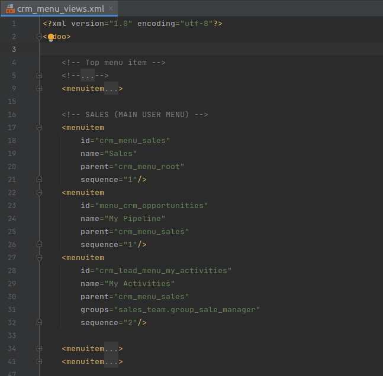
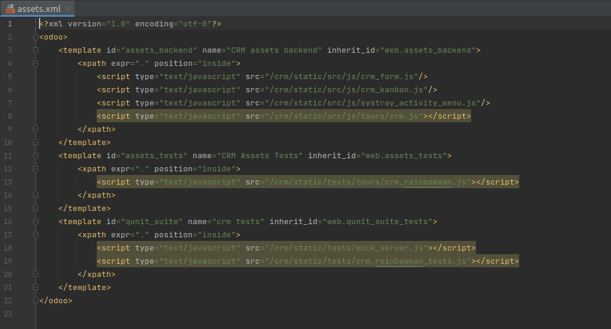
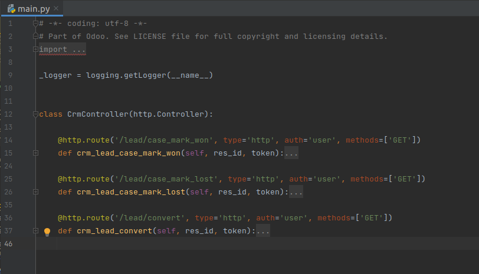
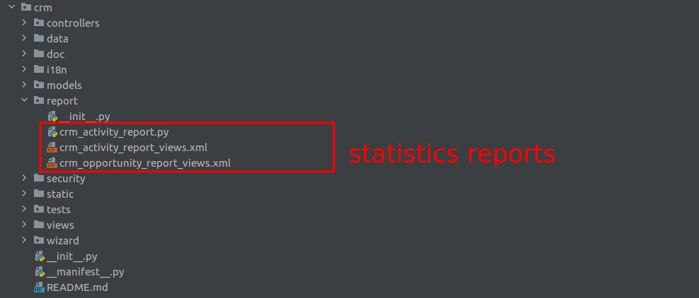
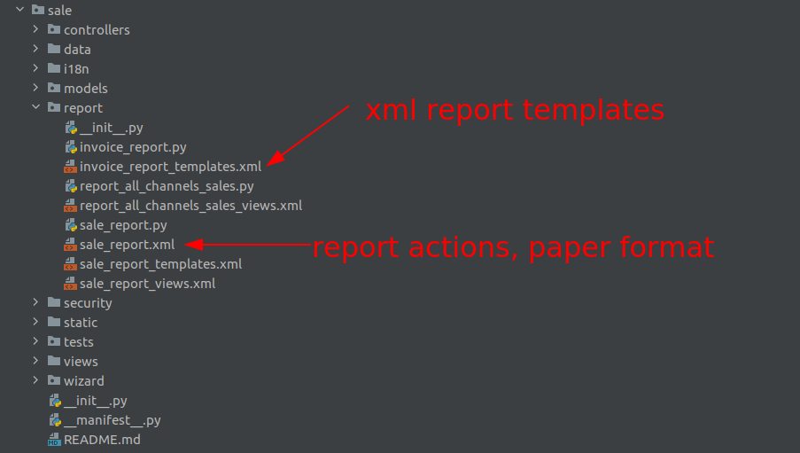
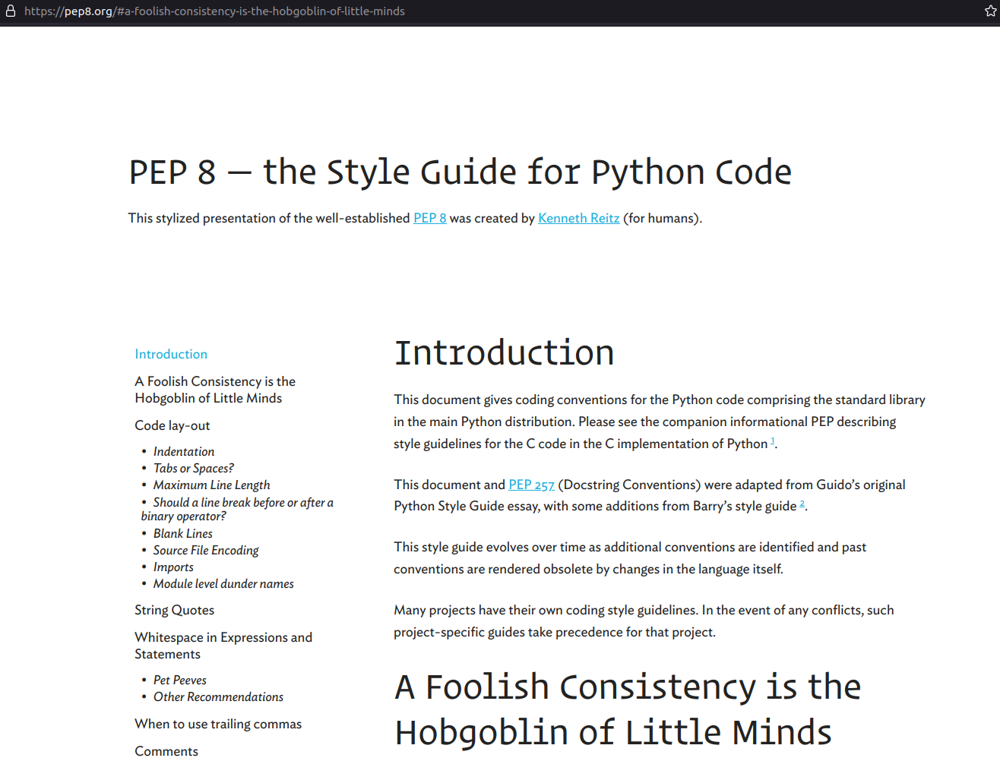
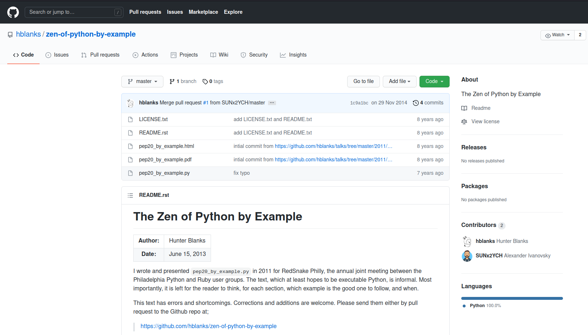
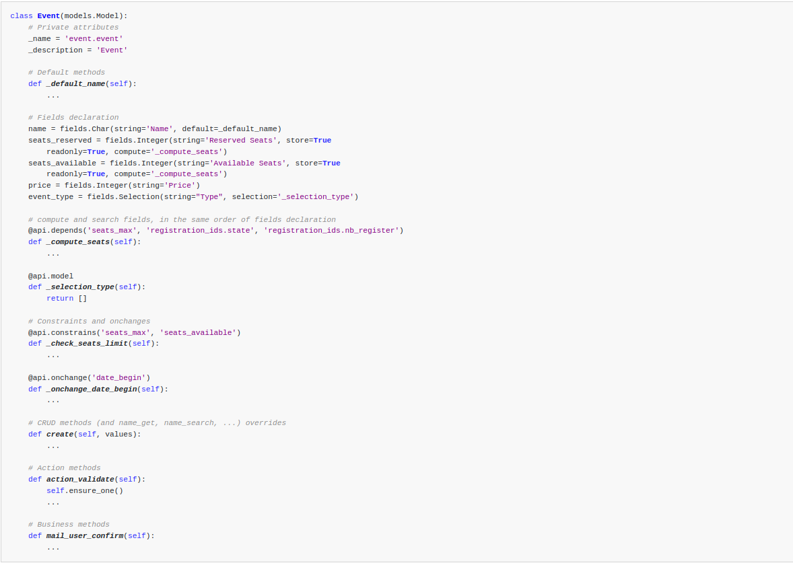

# I. Introduction

## 1 - Why these?

Those aim to improve the **quality** of Odoo Apps code. Indeed proper code improves **readability**, **eases maintenance**, helps **debugging**, **lowers complexity** and promotes **reliability**.

## 2 - What these include?

- Structure and naming conventions
- Formating rule
- Python standard
- Programming in Odoo
- Javascript & CSS
- Git

## 3 - How?

Learn, Learn more, Noob forever?

# II. Module structure

## Directories

```
crm
|-- data: demo and data xml
|-- models: models def
|-- controllers: HTTP routes
|-- views: views and templates
|-- static: web assets
|-- security: access rights and record rules
|-- report
|-- security
|-- tests
|-- wizard
|-- i18n: translations
|-- __init__.py
|-- __manifest__.py
```

## File naming - models

::: columns
:::: column
```shell
models
|-- crm_lead.py
|-- crm_lost_reason.py
|-- crm_stage.py
|-- crm_team.py
|-- res_partner.py
|-- res_users.py
...
```
::::
:::: column
Split the business logic by sets of models belonging to a same main model
::::
:::
## File naming - security

```shell
security
|-- crm_security.xml
|-- ir.model.access.csv
```

## File naming - views 

::: columns

:::: column
```shell
views
|-- assets.xml
|-- crm_lead_views.xml
|-- crm_lost_reason_views.xml
|-- crm_menu_views.xml
|-- crm_stage_views.xml
|-- crm_team_views.xml
|-- res_partner_views.xml
```
::::

:::: column
- backend views: `<model>_views.xml`
- menus: `<module>_menus.xml`
- templates: `<model>_template.xml`
- bundles: `assets.xml`
::::

:::

## Views menu - CRM

{width=60%}

## Views assets - CRM



## File naming - data
::: columns
:::: column
```shell
data
|-- crm_lead_demo.xml
|-- crm_lost_reason_data.xml
|-- crm_stage_data.xml
|-- crm_team_data.xml
|-- crm_team_demo.xml
...
```
::::
:::: column
- Split them by purpose:
  - demo: `<model>_demo.xml`
  - data: `<model>_data.xml`
::::
:::

## File naming - controllers
- outdated: `main.py`
- now: `<module_name>.py`
- inherit: `<inherited_module_name>.py`

{width=80%}

## File naming - static

skip (->___->) ============>

## File naming - wizard

```shell
wizard
|-- crm_lead_lost.py
|-- crm_lead_lost_views.xml
|-- crm_lead_to_opportunity.py
|-- crm_lead_to_opportunity_views.xml
|-- crm_merge_opportunities.py
|-- crm_merge_opportunities_views.xml
```

## File naming - report



## File naming - report


## File naming - Notes

**_NOTE:_**  File names should only contain [a-z0-9_] (lowercase alphanumerics and _)

# III. XML files

## Format

- `id` before `model`
- fields: `name` then `eval` then others (widgets, options, ...)
- group records by model **except** dependencies between action/menu/views
- naming convention (later)

## Format

```xml
<record id="view_id" model="ir.ui.view">
  <field name="name">view.name</field>
  <field name="model">object_name</field>
  <field name="priority" eval="16"/>
  <field name="arch" type="xml">
    <tree>
      <field name="my_field_1"/>
      <field name="my_field_2" string="My Label" 
        widget="statusbar" 
        statusbar_visible="draft,sent,progress,done" />
      </tree>
  </field>
</record>
```

## Format

- syntactic sugar:
  - `<menuitem>`: `ir.ui.menu`
  - `<template>`: `arch` section of qweb view
  - `<report>`: report action (old)
  - `<act_window>`: action window (old)

## XML IDs and naming

### Security, View and Action

- menu: `<model_name>_menu.xml`
- submenu: `<model_name>_menu_do_stuff.xml`

```xml
<!-- menus and sub-menus -->
<menuitem
    id="model_name_menu_root"
    name="Main Menu"
    sequence="5"
/>
<menuitem
    id="model_name_menu_action"
    name="Sub Menu 1"
    parent="module_name.module_name_menu_root"
    action="model_name_action"
    sequence="10"
/>
```

### Security, View and Action

- view: `<model_name>_view_<view_type>`

```xml
<!-- views  -->
<record id="model_name_view_form" model="ir.ui.view">
    <field name="name">model.name.view.form</field>
    ...
</record>

<record id="model_name_view_kanban" model="ir.ui.view">
    <field name="name">model.name.view.kanban</field>
    ...
</record>
```

### Security, View and Action

- action: `<model_name>_action`

```xml
<!-- actions -->
<record id="model_name_action" model="ir.act.window">
  <field name="name">Model Main Action</field>
    ...
</record>

<record id="model_name_action_child_list" 
        model="ir.actions.act_window">
  <field name="name">Model Access Children</field>
</record>
```

### Security, View and Action

- group: `<module_name>_group_<group_name>`
- rule: `<model_name>_rule_<concerned_group>`

```xml
<!-- security -->
<record id="module_name_group_user" model="res.groups">
    ...
</record>
<record id="model_name_rule_public" model="ir.rule">
    ...
</record>
<record id="model_name_rule_company" model="ir.rule">
    ...
</record>
```

## Inheriting XML

- name: suffix .inherit.{detail}

```xml
<record id="model_view_form" model="ir.ui.view">
  <field name="name">model.view.form.inherit.module2</field>
  <field name="inherit_id" ref="module1.model_view_form"/>
  ...
</record>
<record id="module2.model_view_form" model="ir.ui.view">
  <field name="name">model.view.form.module2</field>
  <field name="inherit_id" ref="module1.model_view_form"/>
  <field name="mode">primary</field>
  ...
</record>   
```

# IV. Python

## PEP8 options

Odoo source code tries to respect Python standard, but some of them can be ignored.

{width=75%}

## Imports

```python
# 1 : imports of python lib
import base64
import re
import time
from datetime import datetime
# 2 : imports of odoo
import odoo
from odoo import api, fields, models, _
from odoo.tools.safe_eval import safe_eval as eval
# 3 : imports from odoo addons
from odoo.addons.website.models.website import slug
```

## Idiomatics of Programming (Python)

```shell
>>> import this
The Zen of Python, by Tim Peters

Beautiful is better than ugly.
Explicit is better than implicit.
Simple is better than complex.
Complex is better than complicated.
Flat is better than nested.
Sparse is better than dense.
Readability counts.
Special cases aren't special enough to break the rules.
Although practicality beats purity.
Errors should never pass silently.
Unless explicitly silenced.
...
```

## Idiomatics of Programming (Python)



## Idiomatics of Programming (Python)

- Use meaningful variable/class/method names
- Useless variable
- Know your builtins
- Use list comprehension, dict comprehension, and basic manipulation using map, filter, sum, … They make the code easier to read.
- Collections are booleans too

## Idiomatics of Programming (Python)

You can’t learn to write good code only by following the rules. 

**To learn to write good code you have to write a shit-metric-ton of bad code.**
---- [Going beyond the idiomatic Python](https://hackernoon.com/going-beyond-the-idiomatic-python-a321b6c6a5e6)

## Programming in Odoo

- Avoid to create generators and decorators
- Use filtered, mapped, sorted, … methods to ease code reading and performance.

## Programming in Odoo
Make your method work in batch
```python
@api.depends('user_id')
def _compute_date_open(self):
  for lead in self:
    lead.date_open = fields.Datetime.now() if lead.user_id else False
```

## Programming in Odoo

Propagate the context

- Passing parameter in context can have dangerous side-effects.
- If you need to create a key context influencing the behavior of some object, choice a good name, and eventually prefix it by the name of the module to isolate its impact.

## Programming in Odoo

Keep it **Simple** and **Stupid**

- Split the method as soon as it has more than one responsibility

Never commit the transaction

- You should **NEVER** call cr.commit() yourself, **UNLESS**...

Use translation method correctly

## Symbols and Conventions

### Variables

- model name: singular form
- suffix your variable name with _id or _ids if it contains a record id or list of id

```python
Partner = self.env['res.partner']
partners = Partner.browse(ids)
partner_id = partners[0].id
```

## Symbols and Conventions

### Variables

- `One2Many` and `Many2Many` fields should always have _ids as suffix
- `Many2One` fields should have _id as suffix

## Symbols and Conventions

### Method conventions

- compute field: `_compute_<field_name>`
- onchange method: `_onchange_<field_name>`
- constraint method: `_check_<constraint_name>`

## Symbols and Conventions

### Model attribute order

{width=70%}