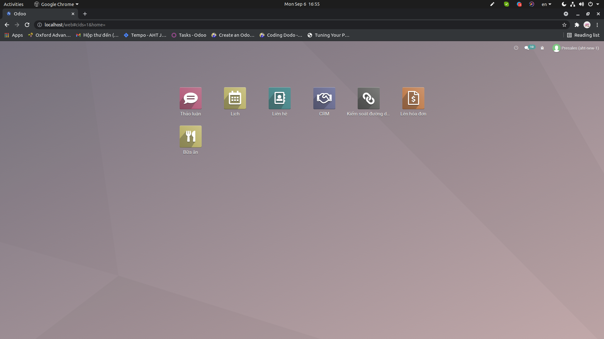
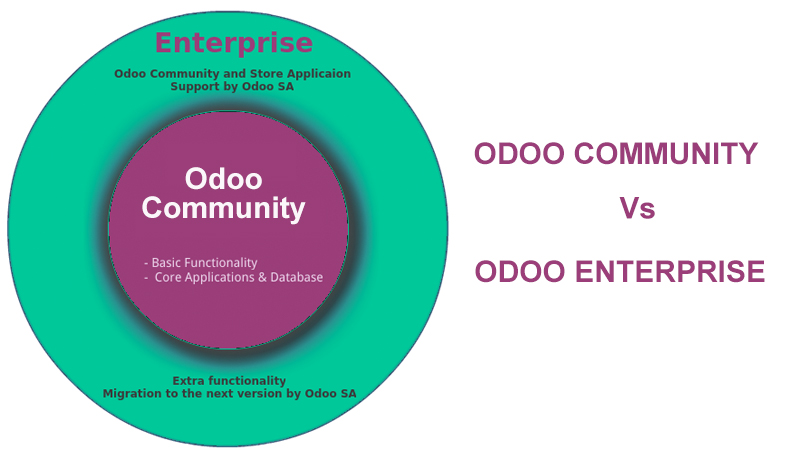
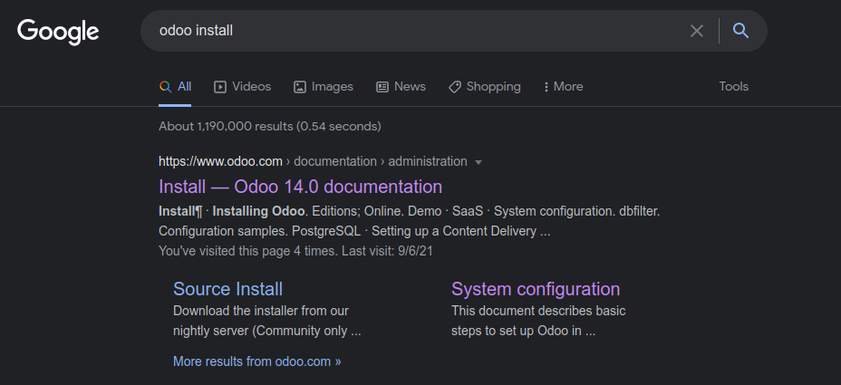

# Introduction

## Table of contents

1. Things required to run Odoo FOR DEV?
2. Steps
3. Recommendations

# Things required FOR DEV?

## Resources - Configuration - Data

{width=60%}

## Resources

1. System (OS, native dependencies)
2. Python (version, virtualenv)
3. Postgresql
4. Odoo Base (community, enterprise)
5. Custom Addons

## Configuration

1. odoo.conf
2. postgresql config

## Data

1. DEV or PRODUCTION

# Resources

## System

- OS: Debian GNU/Linux OS, highly recommend Ubuntu 18,20 LTS
- For libraries using native code, it is necessary to install development tools and native dependencies before the Python dependencies of Odoo.
- These core tools will help us install other Odoo dependencies using simple commands.

```shell
sudo apt install bla bla bla...
```

## Python

- Different Odoo versions require different python versions
- Prepare to work with multiple python versions (pyenv, update-alternatives, ...)
- Odoo dependencies are listed in the `requirements.txt` file located at the root of the Odoo community directory.
- Installed via pip and under **virtual environment** except wkhtmltopdf

## Postgresql

- Supported version: 10.0 and later
- Odoo forbids connecting as `postgres` so you need to create a new PostgreSQL user (normally grant superuser priviledge)

## Odoo Base

{width=50%}

- The master branch is under development and is unstable, so it is advisable not to use this for production since it might break down your database.
- The Enterprise git repository does not contain the full Odoo source code. It is only a collection of extra add-ons.
- `git clone`

## Custom Addons

- The **BIGGEST BUG SOURCE** of your project

# Steps

## Before you start any project, BE AWARE

- There are several ways to setup Odoo!
- Try to make your development environment similar to production environment as much as possible
- Some features in production should be disable in development or at least handle it (cron jobs, licence check, mail, ...)
- Avoid generating local data inside Odoo/Project code base
- Are you sudo user? Be aware of your priviledge and what you do with sudo

## Source Install

- Why?
- Not actually Installation of Odoo, You are running Odoo **directly from source**

## 0. Read the Docs

{width=70%}

## 1. Install dependencies

```shell
sudo apt update
sudo apt install git python3-pip build-essential wget blah blah blah -y
```
- Missing package? &rarr; How to install bla bla bla ubuntu bla bla bla...

## 2. Download and install wkhtmltopdf

```shell
wget https://.../wkhtmltox_0.12.5-1.trusty_amd64.deb
sudo dpkg -i wkhtmltox_0.12.5-1.trusty_amd64.deb
```

Force install dependencies

```shell
sudo apt install -f
```

## 3. Install PostgreSQL

```shell
sudo apt install postgresql -y
```

- Make sure postgresql service is running

## 4. Configure PostgreSQL

```shell
sudo -u postgres createuser --superuser $(whoami)
```
- psycopg2

## 5. Configure git

```shell
git config --global user.name "Your Name"
git config --global user.email youremail@example.com
```
- git pull

## 6. Clone Odoo code base

```shell
git clone -b 14.0 --single-branch --depth 1 https://github.com/odoo/odoo.git
```
- You can place Odoo code base anywhere
- Only you know the best way to handle them

## 7. Create virtual environment

```shell
python3 -m venv ~/your_venv
```
- You can place your venv anywhere

## 8. Install Python dependencies in venv

```shell
pip3 install -r requirements.txt
```
- Make sure you activated your venv
- Your projects may have other additional requirements.txt

## 9. Create and start your Odoo instance

- Things are different depends on your project
- You should understand how to use `odoo-bin`

```shell
./odoo-bin --help

python3 odoo-bin -d odoo-test -i base --addons-path=addons --db-filter=odoo-test
```

# Manage databases

## Accessing the database management interface

- Manage Database link (under login button)
- `/web/database/manager`
- `/web/database/selector`
- master password

## Or access directly to postgresql and do whatever 

- createuser, createdb
- pg_restore, pg_dump
- systemctl

# Configuration

## odoo.conf

```
[options]
addons_path = /home/misamisa/odoo-dev/AMPM/ampm-odoo-11/odoo/addons,...
admin_passwd = ShiroMoeMoeMoaMoaChuChoa
csv_internal_sep = ,
data_dir = /home/misamisa/odoo-dev/AMPM/.local/share/Odoo
db_maxconn = 128
db_host = localhost
db_name = False
db_password = misamisa
db_port = 5433
db_user = misamisa
...
```
- What?
- Why?

## How to do it?

```shell
./odoo-bin --save --config myodoo.cfg --stop-after-init
./odoo-bin -c myodoo.cfg
```
- Path in configuration file should be absolute
- Order for passing parameter:
  1. default (defined by source code)
  2. configuration file
  3. via commandline

# Some Recommendations

## Prepare for working with many projects

```
|--odoo-src
|  |--enterprise
|  |  |--14.0
|  |--odoo
|  |  |--14.0
|  |  |--master
|--odoo-dev
|  |--AMPM
|  |  |--ampm-odoo-11
|  |  |--ampm-odoo-addons
|  |  |--venv
|  |  |--.local
|  |  |--odoo.conf
|  |--ahterp
|  |  |--custom-addons
|  |  |--odoo.conf
|  |  |--venv
|  |--template-project
|  |  |--bin
|  |  |--local
|  |  |--filestore
|  |  |--logs
```

## Choose your editor

- Pycharm, VS Code, Atom or even Vim :D
- Utilize the power of plugins
- You should know how to use your editor and how to config it
- Hard work first, then life will easier later (not sure when :/)

## Others

- Update Apps List
- addons_path
- master_password
- reverse proxy
- Activate/Deactivate debug mode

## Others

- whoami
- security considerations
- always prepare a backup
- read the log
- maximize utilisation of `odoo-bin`

## Others

- restart service / upgrade moudles / reload browser?
- Experienced Odoo developers generally don't use the database management interface and perform operations from the command line

## BEAR IN MIND

**DEBUGGING AND LOGGING IS YOUR MAGIC WAND**

# Thank you