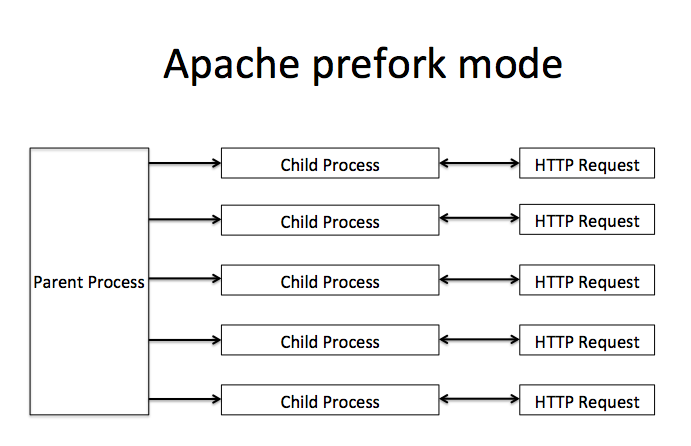
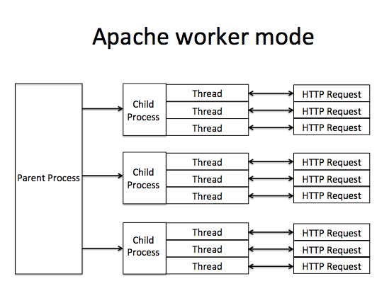

# Thread & Process

## What is Process?

### Process

::: columns
:::: column

- **Process** is a program in execution state
- Process Control Block (PCB) is the brain of process

::::
:::: column

{width=60%}

::::
:::

## What is Thread?

### Thread

- a single flow of execution
- belongs to a process
- can be considered as a lightweight process

## Single-threaded process

- Default
- Only one thread per process

## Multi-threaded process

::: columns
:::: column

- More than one thread per process
- Share memory allocation (heap, global data) among threads
- Different stack

::::
:::: column

::::
:::

## Thread vs Process

| Process                              | Thread                                    |
|--------------------------------------|-------------------------------------------|
| heavy weight                         | light weight                              |
| context switches are time consumming | context switches are less time consumming |
| independent                          | interdependent                            |
| inter-communication is not easy      | inter-communication is simpler            |

## CPU-bound and I/O-bound processes

- A program is **CPU bound** if it would go faster if the CPU were faster
  - do mathematical computations
- A program is **I/O bound** if it would go faster if the **I/O subsystem** (disk, networking) was faster
  - waiting for Input/Output which can come from a user, file, database, network, etc.

# Multithreading and Multiprocessing

## Multithreading

### Pros

- make responsive UI
- ideal option for I/O bound applications

### Cons

- synchronization
- race condition & deadlock
- @__@ code

## Multiprocessing

### Pros

- get more work done in shorter period
- straight forward code
- take benefit form multiple CPUs & cores

### Cons

- IPC is complicated and overhead
- large memory footprint

## TLDR

You can use **threading** if your program is **network bound** or **multiprocessing** if it's **CPU bound**

## Real app - Multiprocessing

{width=60%}

## Real app - Multiprocessing, multithreading

{width=60%}

# Python and GIL

## Back to the old days

- Python wasn't designed considering that personal computers might have more than one core.
- Python is OLDDDDDDDDDDD...
- World is one core :P, threading existed but not for computing power

&rarr; Multi-threaded applications' problems :/

## The **Infamous** feature of Python - GIL

### What is GIL?

**Global Interpreter Lock**

- One massive log, on everything
- Only interpret one thread of Python at a time

&rarr; Threads never run at the same time

&rarr; silly, uneeded, behind the times, ruins things... (/pats)

## Why **still** Python GIL? - The trade-off

Multi-core is **everywhere** now

### Pros

- Readability First
- Reference Count as memory management
- Easy to get right
- No deadlocks
- I/O bound: ok
- CPU bound: single threaded

> the design decision of the GIL is one of the things that made Python as popular as it is today. - Larry Hasting

## Why **still** Python GIL? - The trade-off

> It isn't Easy to Remove the GIL - Guido van Rossum

# In Odoo

## Multiprocessing and Threading in Odoo

- Odoo includes built-in HTTP servers, using either multithreading or multiprocessing.
- Multiprocessing is enabled by configuring `a non-zero number of worker processes`
- In multiprocessing, a dedicated LiveChat worker is automatically started and listening on the `longpolling port` but the client will not connect to it.

## The Odoo workers

**What would happend to Odoo without workers?**

- `--workers <count>`: if `<count>` is not 0 (the default), enables multiprocessing and sets up the specified number of HTTP workers (sub-processes processing HTTP and RPC requests).
- The `workers number` is different between self-hosted and `Odoo.sh`
- For Odoo.SH a "worker" is actually a multi-threaded task queue

## The Odoo workers

- 6 or 8 is a minimum, even if you don't have enough CPUs - *Odony*
- `2 x num_cpus + 1`

## The Odoo workers

- For multi-processing mode, this is in addition to the HTTP worker processes.

- The real limit to the number of workers is the RAM, not the CPUs

- `--limit-memory-hard`: Hard limit on virtual memory, any worker exceeding the limit will be immediately killed without waiting for the end of the current request processing.

- `--limit-memory-soft`: Maximum allowed virtual memory per worker. If the limit is exceeded, the worker is killed and recycled at the end of the current request.

- `--max-cron-threads`: number of workers dedicated to **cron** jobs. Defaults to 2. The workers are threads in multi-threading mode and processes in multi-processing mode.
- `--no-http`: do not start the HTTP or long-polling workers (may still start `cron` workers)

## Notice when in debug

- Run the server with `--workers=0` to avoid multiprocessing issues that can cause the same breakpoint to be reached twice in two different processes
- Run the server with `--max-cron-threads=0` to disable the processing of `ir.cron` periodic tasks, which may otherwise trigger while you are stepping through the method, which product unwanted log and side effects