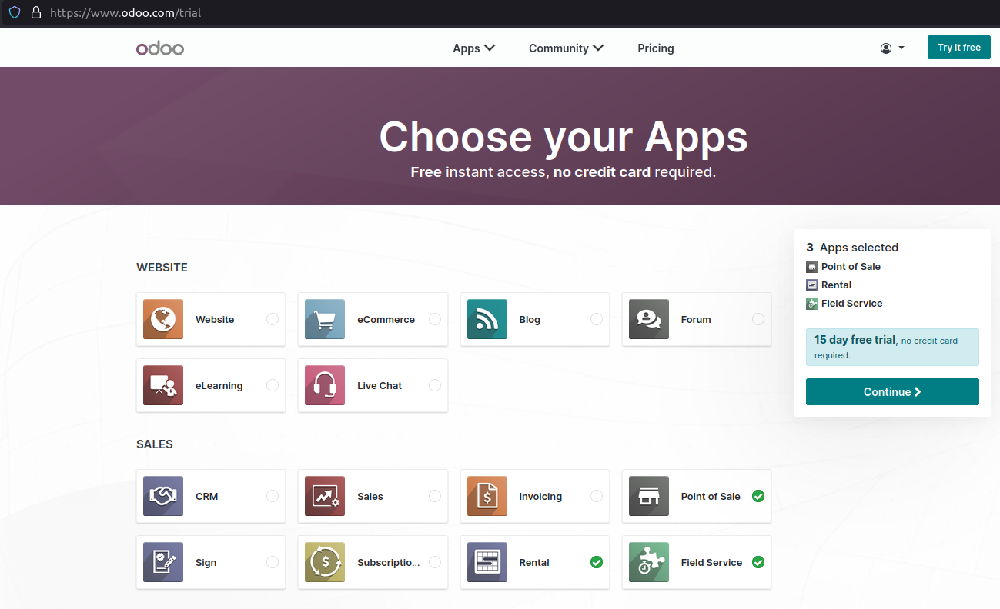
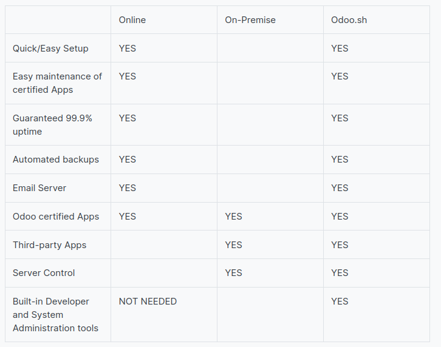
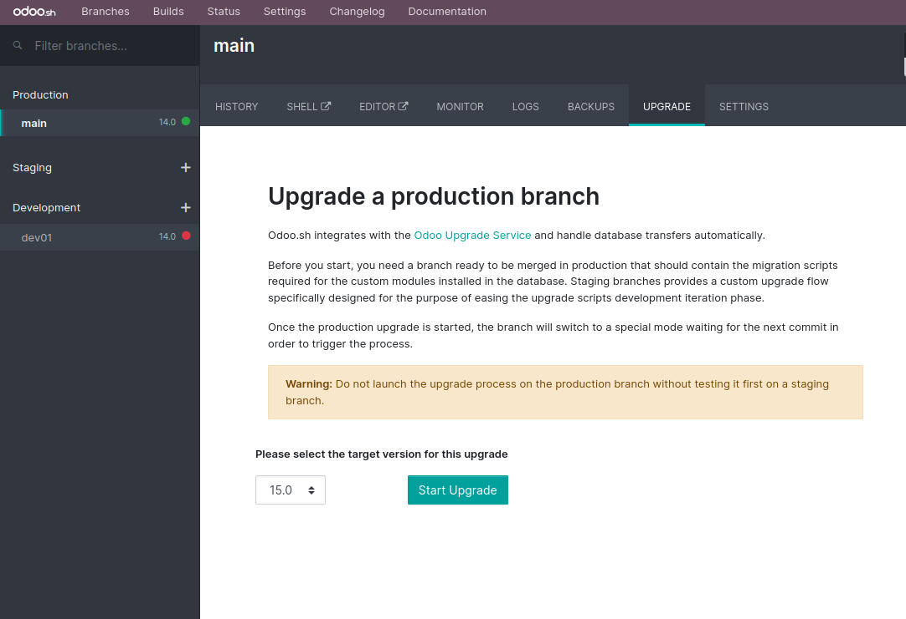
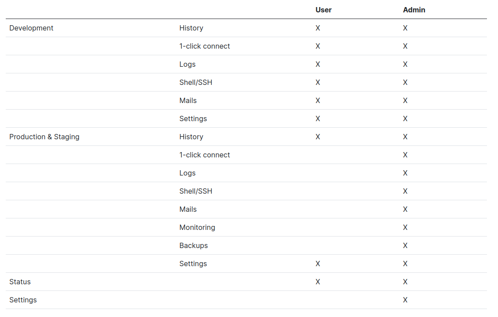
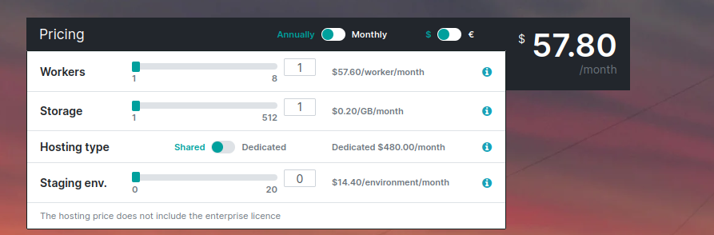

# Odoo hosting types

## Odoo Online - SaaS

{width=70%}

## Odoo Online - SaaS

- Cloud-based
- Internet connection required
- No installation required
- No server maintenance required
- Migration to updated version included
- Email server included
- 100% hacking-safe ???
- Odoo standard (no cutomizations)
- Odoo apps only (no third-party apps)

## Odoo On-premise

You need to download the software and install it, either on your computer or on your server.

You are **responsible** for **everything** related to the running of the software

- Local installation
- Customization possible (on existing apps or to create new apps)
- Third-party application installation possible
- Technical knowledge required to ensure maintenance, back-ups, safety of data
- Migration to updated version included
- Full control, full autonomy and full responsibility

## The disadvantages

- Inflexible (Online)
- Maintainance efforts (On-premise)

## Odoo.sh - (PaaS)

 Odoo's Platform as a Service (PaaS) cloud solution

{width=70%}

## Odoo SH Features

- Github Integration
- CI/CD
- Logs
- Shell
- Module Dependencies
- Mail Catcher, Mail Server
- Testing
- Monitoring
- DNS
- Up to date
- Instance Recovery

# Branches

## Stages

- 3 Stages: Production, Staging, Development
- Migrating configuration
  - Write them in XML, increase module version number &rarr; merge
  - pass them manually

## Tabs

- History
- Mails (staging & dev)
- Shell
- Editor
- Monitor
  - Metrics
  - Profiling

## Tabs

::: columns
:::: column

- Logs
  - odoo.log
  - pip.log
  - install.log
  - odoosh-import-database.log
  - pg-slow-queries.log
  - jupyter-lab.log
  - update.log

::::
:::: column

- Backups
  - Testing/Exact dump
  - With/without filestore
  - auto & manual backup (limit 5/day)
  - database dump, filestore, logs, sessions.
  - 14 full backups of each Odoo production instance for up to 3 months
  - 1/day for 7 days, 1/week for 4 weeks, 1/month for 3 months.
  - a backup with `Update` tag

::::
:::

## Tabs

- Settings

::: columns
:::: column

- Behavior upon new commits:
  - New build
  - Update prev build
  - Do nothing

- Module installation
  - Install only my modules
  - Full installation (all modules)
  - Install a list of modules

::::
:::: column

- Test suite (only dev)
- Odoo version
  - Latest (weekly update)
  - Fixed (expired in 3 months)
- Custom domains
  - Dedicated servers have static IP addresses
  - Shared servers static IP address cannot be guaranteed
  - HTTPS/SSL
  - SPF and DKIM compliance
- Operating System

::::
:::

# Builds

## Build:

A build is considered as a database loaded by an Odoo server running on a specific revision of your project repository in a containerized environment.

A build is created when
- push new branch
- import database
- rebuild

## Build Stages

Builds for Stagging and Production are in the same server but they access different codes and database, while builds for development are in other servers

# Status

# Changelog

## Upgrade Odoosh

{width=60%}

## Credentials security check

For staging and production databases, any detected demo/test passwords are now removed automatically when a database is created, imported or restored from a backup

# Settings

## Overview

- Project name
- Collaborators

{width=60%}

- Public Access
- Custom domains
- Storage Size
- Database Worker
- Staging Branches
- Activation

# Online Editor

# Container

## Container

- directory structure
- database shell
- odoo shell
- debug

# Submodules

## Submodules

- git submodules
- pin specific version
- use and depend on modules available in other repositories
- configure a deploy key for private repo
- ignore modules

# MISC

## Some Notes

- Do not expect any scheduled action to be run more often than every 5 min.
- Scheduled actions do not run at the exact time they were expected
- Odoo.sh always limits the execution time of scheduled actions
- Idle Odoo workers may be terminated after a reasonable amount of time and will be automatically re spawned upon the next activity
- Deleting the Github repository does not delete the project
- Instance API, no platform API
- Odoo Online & Odoosh do not expose the postgresql clusters to the internet.

## Pricing

{width=70%}

## Trial project

- 1 worker, 2 stagings, 1GB storage per build
- 30 days
- 60 days after expiration
