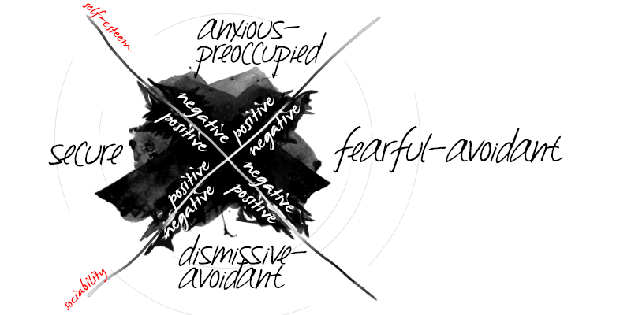

# What is Attachment Theory 

## Intro

Apr 1st 2022

## An area of psychology

> **Attachment Theory** is an area of psychology that describes the nature of emotional attachment between humans. 

## History

- 1950s
- Bowlby and Ainsworth

> the nature in which infants get their needs met by their parents significantly contributes to their “attachment strategy” throughout their lives.

> -- <cite>Ainsworth, M. S., & Bowlby, J. (1991</cite>

## Why

- It helps us understand:
  - why your close relationships have succeeded/failed
  - why you’re attracted to the people you are attracted to
  - the nature of the relationship problems that come up again and again for you

## As a theory

- Bowlby and Ainsworth
  - the earliest bonds formed by children with their caregivers have a tremendous impact that continues throughout life
  - attachment as a product of evolutionary processes
  - nurturance and responsiveness were the primary determinants of attachment

## Maternal Deprivation

- Harry Harlow
- emphasizes parent-child attachment relationship and the importance of maternal touch in infant development
- Attachment != intimate contact

# Stages of Attachments

## 4 Stages of Attachment

- Pre-Attachment (<= 3m):
- Indiscriminate Attachment (6w-7m): infants start distinguishing between familiar and unfamiliar people, responding more positively to the primary caregiver. 
- Discriminate Attachment (7-11m): infants show a strong attachment and preference for one specific individual.
- Multiple Attachments (>9m): children begin to form strong emotional bonds with other caregivers beyond the primary attachment figure.

## Things affects attachment formation

- **Opportunity for attachment**: parent lost, divorce, family abuse, war,..

- **Quality caregiving / Nuturance factor**: responsiveness/ignorance, agree/disagree, encourage/discourage, truth/deceive, lack/excessive, free/restraint, synpathize/coldhearted

# Four Attachment Styles

## Terminology

**Safe base**

**Attachment Style != Personality**

## Secure Attachment Style

- comfortable displaying interest and affection
- comfortable being alone and independent
- display a healthy level of self-confidence
- correctly prioritize their relationships
- tend to draw clear boundaries and stick to them
- capable of accepting rejection and moving on despite the pain
- apable of being loyal and sacrificing when necessary

## Anxious Attachment Style

- They need constant reassurance and affection from their partner
- They have trouble being alone or single
- They have trouble trusting people
- rely on others for their emotional needs

## Avoidant Attachment Style

- construct their lifestyle in such a way to avoid commitment or too much intimate contact
- avoid longtern responsibility
- bad at expressing themself

## Anxious-Avoidant Attachment Style

- low in confidence and less likely to express emotions, preferring to suppress them

**You can exhibit tendencies of more than one strategy depending on the situation and at different frequencies**

## Relationship Configuration

- Secure Styles are capable of dating (or handling, depending on your perspective) both anxious and avoidant types
- Anxious and avoidants frequently end up in relationships with one another

**Secure - Secure**

**Unsecure - Unsecure**

# Can your Attachment Styles change?

## When attachment is fragile

- Workplace
- School
- Internet
- Family

## Why ?

- Some even have successful long-term relationships as an anxious or avoidant
- Secures are consistently more happy and feel more supported,26 are less likely to become depressed,27 are healthier,28 retain more stable relationships, and become more successful29 than the other types
- Your attachment style can change over time although it’s **slow** and **difficult**
- Extreme negative life events, such as divorce, death of child, serious accident, etc., can cause a secure attachment type to fall into a more insecure attachment type

## How ?

## We are envolving toward unsecure type

- modenization
- kindergarten, nursing home
- from generation to generation
