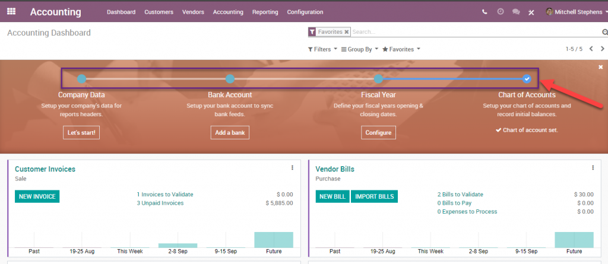
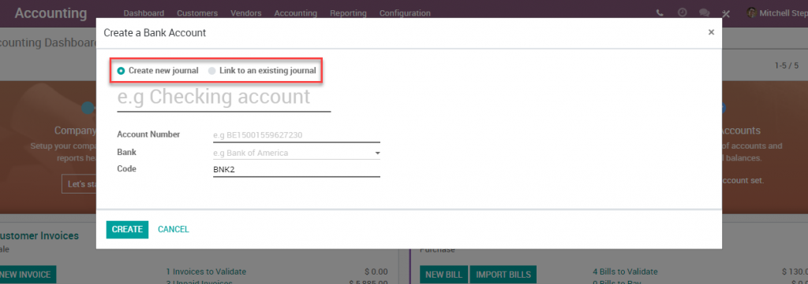
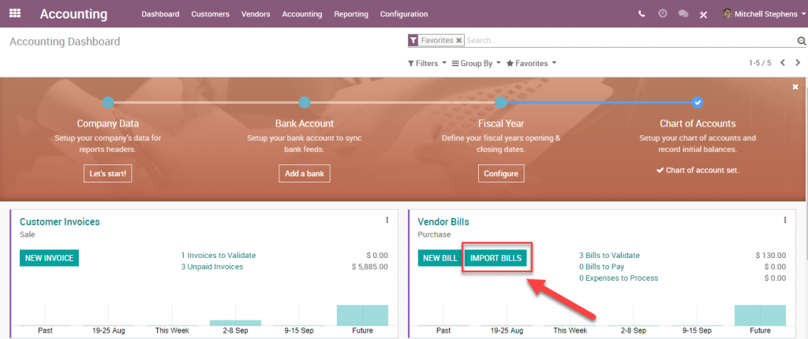
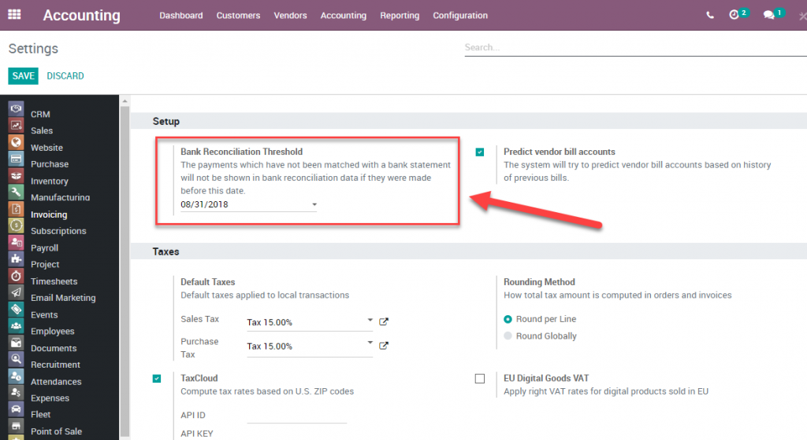
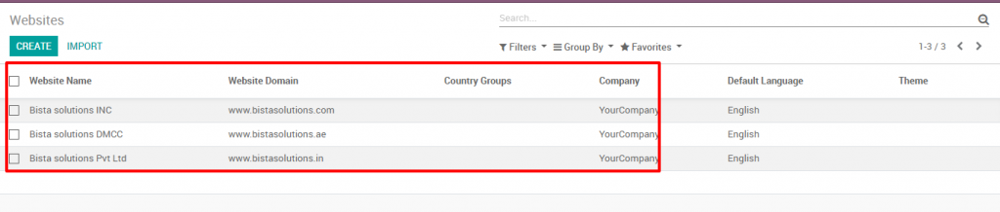
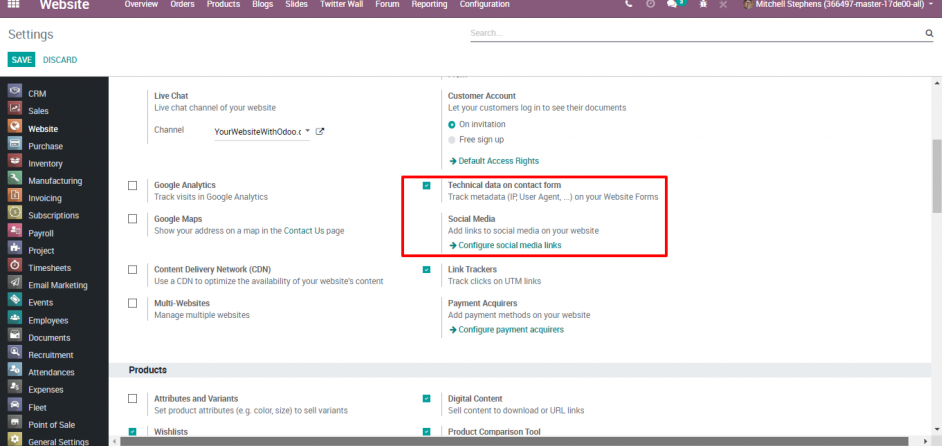

# Odoo 12 New Features

## Accounting

- From the progress bar, you now have the ability to create a new bank account directly, rather than having to go to Settings first:

- During ‘Create a Bank Account,’ Odoo gives you the option to create a new journal or link to an existing journal:

- Import Vendor Bill from Accounting Dashboard directly and send to OCR:

- Bank Reconciliation Threshold:

- Customer/Vendor Receipt, which gives you the ability to collect or pay money with defining a specific partner.

## Website

- Multi-website support, allowing configuration of as many websites as desired. Can also choose a different theme for each website:

- User metadata capturing, such as IP address and a user device, while generating a lead from the website through the Contact Us page.

