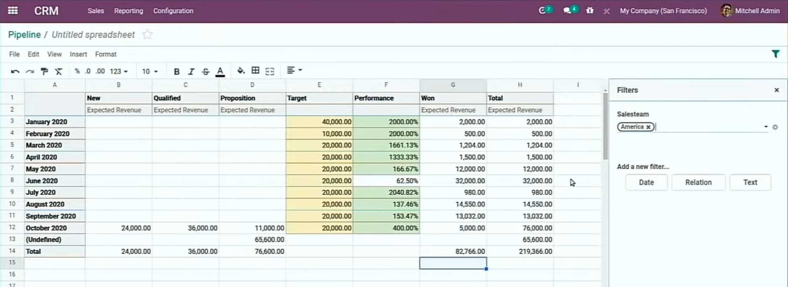
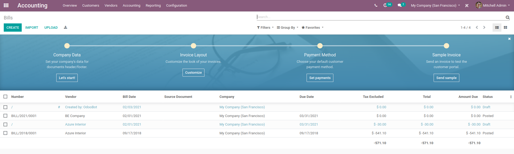
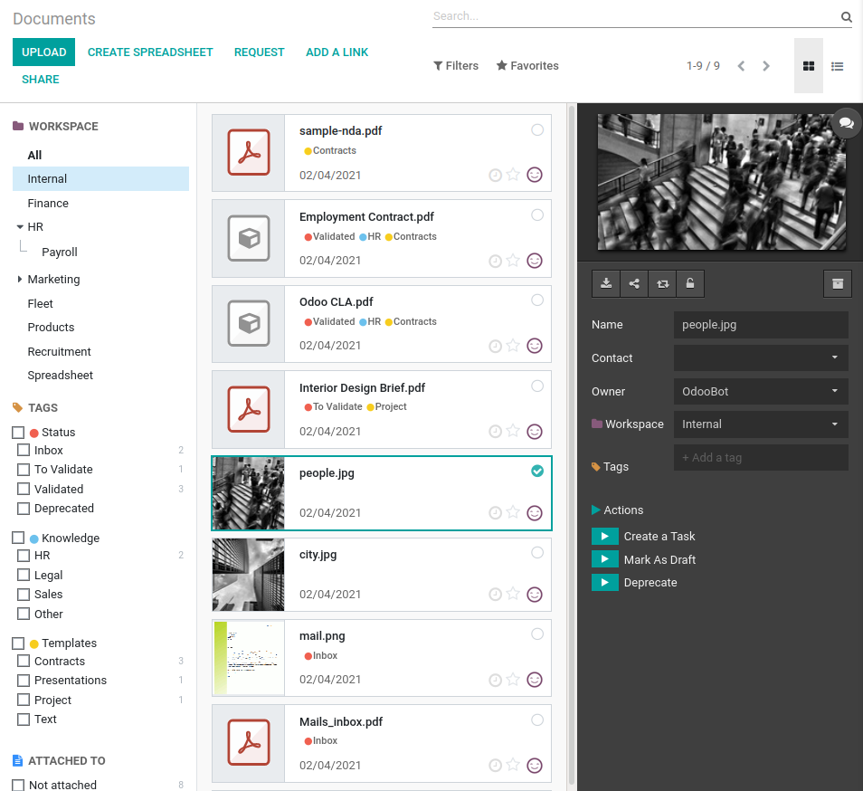

# Website

- change picture quality (make website loadfaster)
- list view improved

- expected recuring revenue in CRM opp

# Inventory

- Replenishment
  - safety stock minimum
  - maximum
  - lead time to procure the different products, base on this lead time, we check the future forecast of this stock and if it's below the safety stock, then we will reorder to get up to the maximum
  - small icon beside quantity:
    - forecasted stock
    - available (red icon when available < qty order)

  - If your product is not available (because all the on-hand products are reserved), change the priority of the delivery order -> your product is reserved
  - Forecasted = On hand - confirmed orders (after sum of lead time vendor lead time + purchase security lead time + days to purchase)
  - Forecasted + Pending = onhand - confirmed orders + incoming products - unconfirm orders (quotations)

# Barcode

- wave picking
- batch picking
- cluster picking

# Timesheet

- Shortcut for switching project and log work
- use hot key to add 15m to a specific project

# Expenses

- record expenses by snapping a picture (Odoo App)

# Manufacturing

- Create MO without BoM (you define work orders directly in MO form)

# Purchase

- Better list view

- show on-time delivery rate of vendor on RFQ

- Ask confirmation checkbox: send and email to the vendor to make sure they can confirm delivery on the date specified in purchase order.
- When the vendor receive email, they can confirm or update the delivery date (line by line) on the purchase order

# Business Intelligence Reporting Engine

- It works on the all applications of any module
- With the new javascript framework of odoo, building report is 40 times faster then v13

# Data Cleaning

- Help you clean the data automatically (so that reporting is more efficient)
- Merge duplicate contact (choose the priority when merging) (can do the same for any models)
- Configure the rule for deduplication
  - manually: you configure the rule, system recommend you, you decide to merge or not
  - automatically: system do all (with a threshold) based on your rule

# CRM

- Opp with recurring revenue (view report with MRR)

# Microsoft Integration

- add contact to Odoo from Outlook
- sync calendar with Microsoft calendar

# Appraisal

- quick schedule appraisal and ask for feedback
- create survey for feedback template

# Survey

- get attendee answers in real-time

# Accounting

## Vendor bills

## Expense

- AI digital analyze can update the product, price, date and even the acounting information for the receipt
- Behind the scene, we categorize all expenses in diff categories (food, restaurants, parking, travel..). User can link category to the products. You can link the expense acount to the product
- New Disallowed Expenses Report: Disallowed expenses are those expenses that cannot be deducted in the fiscal result but can be deducted in your bookkeeping result

## Reporting

- Odoo Spreadsheet
- Not only in Accounting but everywhere else

## Currency

- New Report when enabling Multi-currencies: Unrealized currency gains/losses

- Post the entry for adjustment of currency gain/loss automatically (or manually) - other info tab
- Adjustment entry will be automatically posted at the correct accounting date

## Taxes

- Larger range of tax return possibilities

## Payment Refractoring

- The balance sheet will be updated at every moment and synchronized with bank statement
  - Every Bank Journal will have specific Suspense Account: the moment you synchronize bank statements / import bank transactions, they re immediately posted
  - the bank account then will be updated in BL sheet

- Add transfer accounts and track payments

- Any payment register (for invoice or bills) will be automatically posted to transfer accounts

- The journal entries for bank statement is automatically posted with the counterpart is the suspense account

- After reconciliation of the bank statement, the right account will be updated in the journal entries

## Implement Accounting

- Invoicing, Inventory, eCommerce,... are integrated with Accounting (event when u r not installing it on your server). They also create accounting entries
- But when you want to start with the official Accounting application, you just want to import the opening balance
- If u dont do anything, the opening balance tgt with all accounting transaction

# Documents

- Already have some spreadsheet templates for you, can create your own template

- One template can use several pivot tables so you can bring different pivot tables in the same report
- The template is dynamic (can filter, add fomular, data updated when you change a field)

- AI & Documents management
  - 95.88% recognition rate &rarr; less time on manually input work
  - Capture: subtotal, currency, dates (due, invoice), tax amount, invoice ref, bank account, supplier (find in database for the name, address, website, create right on the fly if not exist)
  - Not only bill, but also expense (scan receipts)
  - send bill directly to Accounting

- manage documents for each workspace (can create as many workspace as you want): Finance, HR, Internal,..
- workspace can be hierarchy
- easy to send a file to Documents App by using email alias

- split document easily
- The AI take responsible for providing the correct expense account for vendor bill (by remember the combination of the label, supplier)

