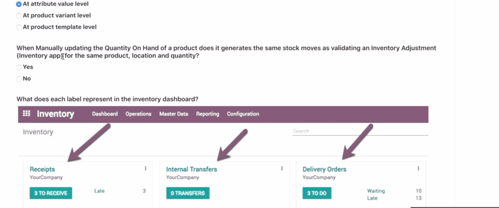

1. Vendor list of products will be automatically added to Request for Quotation every time we create it - False
2. In the Sales-team reporting section, how is the untaxed total amount calculated? - Total amount of the validated sales order.
3. A customer is linked to the Public Pricelist. You have created a quotation for that client for several products. If you change the pricelist on the quotation, what will happen to the price of the products on the quotation - Only the price of newly added products will be calculated using the new pricelist
4. What is the impact of setting the ’control purchase Bill’ on the product as ‘On Ordered quantities’? - When creating a vendor bill, quantities and prices are automatically filled with the orders ones.
5. Assume you have an agreement with a vendor for a specific quantity of a product at a predefined price. How will you keep track of the quantity of products purchased as part of this agreement? - Link this agreement to all the RFQs you would like to associate with this agreement
6. A request for quotation is automatically created every time: - The routes on the product are set as Make to order & Buy, and the sales order is validated
7. Once a manufacturing Order is validated, can I produce more than what is expected? - Yes
8.  What does each label represent in the inventory dashboard?

Operation types available for a given warehouse
9.  Where do you set up stock valuation accounts - Only Product Categories
10. Where can we define the roles of approvals for Engineering change orders? - ECO level
11. Is it possible to manufacture a product without a routing - Yes
12. How is the Mean Time Between Failure, MTBF calculated - Total uptime / # breakdowns
13. How can you configure Odoo to automate the creation of preventive maintenance request? - Set up preventive maintainence frequency on the equipment (machine tools)
14. Where do we define the automation of a probability rate for an opportunity? - In the settings of kanban stage
15. What is the impact of setting a sales team on pipeline stage?
    1.  Specific sales team that use this stage
    2.  Other teams will not able to see or use this stage
16. Which of the following operation can you achieve by sending an email to Odoo? - Automatic creation of leads on a mail sent to a specified address
17. I want emails sent to a specific email address to generate leads (not opportunity) where do I have to set it? CRM Configuration
18. Is it possible to define internal reference per product variant? - Yes
19. Prodcut variant A is at price 100$ higher then product variant B, where do I define this difference in price? - Product variant form
20. I want to reimburse employees 0.4$per km when they travel with their own car for business, which configuration should you use? - Define a product with the "Can be Expensed" field and a cost of 0.4
21. In application process, when is the application considered as hired - When the employee is created from the application
22. It is still possible to directly invoice a selection of timesheet lines? - No (...)
23. What automatically triggers the Kanban status change?
24. Can task stages be shared accross multiple different porjects? - Yes
25. How do you restrict visibility of tasks that are linked to a project? - Set privacy level on project
26. Is it possible to define different Kanban stages for different projects? - Yes
27. What happened when you validate an internal transfer between two bank accounts? - 2 journal entries are created, one in each of two different journals then reconciled
28. What happens if an account is managed in a different currency than the company? - Odoo stores amounts in both the company currency and the account currency
29. What does the system do when you reconcile a line on a bank statement using the reconciliation tool? - It will either create a new journal entry or link an existing entry to the statement
30. Can Odoo support linear depreciation ? - Yes
31. Follow up actions are triggered based on which calculation? - Number of days overdue starting from the due date of the invoice
32. I manage a product whose cost is based on an average cost AVCO, suppose I have 8 pieces of product in stock with s cost of 100$/piece, if I purchased and receive 2 new piece for a price of 10$ each what will be my cost? - 82
33. I manage a product whose cost is based on FIFO, suppose I have 9 pieces of product in stock with s cost of 100$/piece, then I sold one unit, after that I purchased and receive 2 new piece for a price of 10$ each what will the cost in product form cost? - 82
34. If a product has several vendors, which one is proposed on RFQ? - The first supplier in the list
35. If I manage a product whose cost is based on a standard price, suppose I have 8 pieces of product in stock with s cost of 100$/piece, if I purchased and receive 2 new piece for a price of 10$ each what will be my cost? - 100
36. What is the impact of setting the “Control Purchase Bill” on the product as “On ordered quantities”? - When creating a vendor bill, qty and prices are automatically filled with the orederd ones
37. When I create a purchase agreement and select a vendor, are product prices automatically proposed? - No
38. How can you generate a call for tenders for every sales order of a specific product ? - Check “Propose call Tender” on the product form
39. If the costing method is average cost will the cost in the product form change when I receive some products? - Yes
40. When you purchase a new products , how is the scheduled receipt date computed? - Order date + vendor Lead time
41. On a sales order , how is the commitment date set? - commitment date = expected date + lead time
42. What is the Customer Lead time field used for on the product form? - It computes the deliver order date when the quotation is confirmed
43. What is the goal of the stock input/output account fields on a product category form? - Trach export and import values of products
44. Which condition is necessary when using s default unit of measure and purchase unit of measure?
45. Which condition is necessary when using s default unit of measure and purchase unit of measure?
    - [ ] The purchase unit of measure must be the same category as the default one
    - [ ] In a quotation line, unit price is automatically updated when changing the pricelist on the quotation
    - [ ] Both are true.
46. Which of the following is true regarding the unit price of a product in a quotation? - With pricelists activated , when adding a quotation line, the unit price is computed using the selected pricelist
47. What is the relation between the commitment date of a sales order and the delivery date of its delivery order? - Delivery Date = Commitment Date – Product Lead Time
48. What happens with an opportunity that marked as lost? - Opportunity is archived and becomes invisible
49. When is the surcharge applied in the price computation of pricelist? - After the discount and before the rounding.
50. Which of the following is true when check “ Display Margin on quotation and sales orders” under sales > Configuration> Settings - Margins are only displayed on sales orders , not quotations
51. Is not it possible to group expenses before submitting them to the manager? - No
52. How can I sort my products so I have sub-menus on my PoS front-end? - By using categories
53. Which feature will help me cross-sell? - Both Accessory and Optional Products
54. I've created a "Buy 3 - Get One Free" promotion program on my large desks. When will it be triggered? Once you have added four large desks to your cart
55. Where should my customers add a promo code? - On the cart review OR during the checkout
56. Does Odoo use multi-language? - Yes
57. How many times can each coupon code be used? - 1 time
58. Does odoo store your answers to be analyzed in back end once your answer the question and move to next page ( before submitting the survey)? - Yes
59. Does odoo store your answers to be analyzed in back end once your answer the question and move to next page ( before submitting the survey)? - Yes
