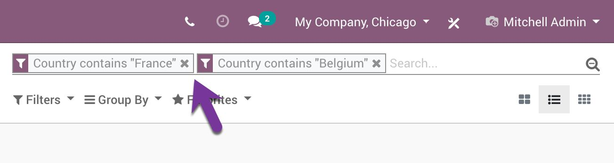
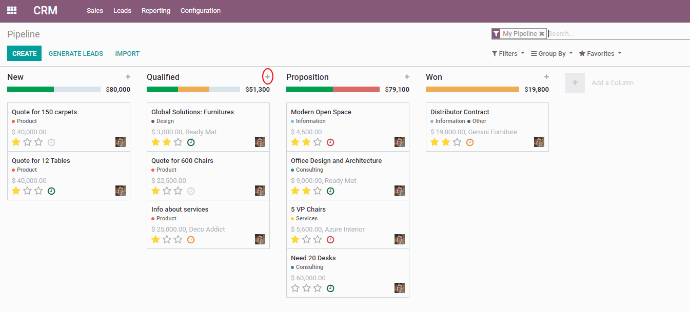
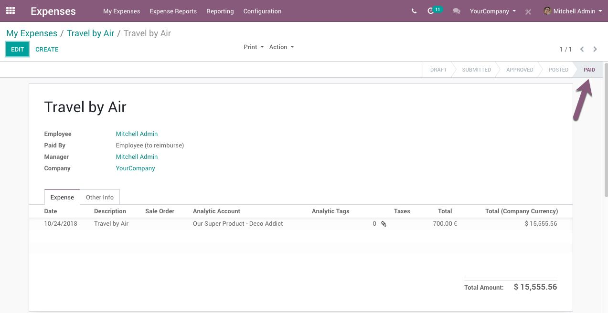
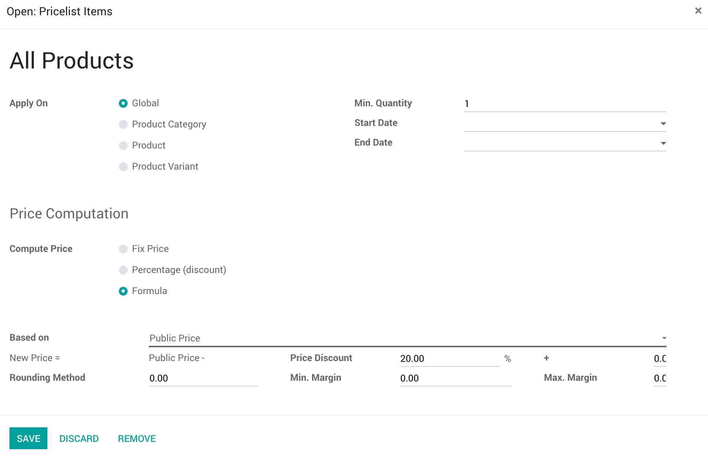

# About Odoo Certification
## The main focus
- Sales
- CRM
- eCommerce
- Accounting/Invoicing
- Inventory
- Purchase
- Manufacturing
- Employees
- Timesheets
- Projects
- Expenses
> The answers often in e-learning
> Focus on Odoo Enterprise
> Follow  the business logic
## Learn Odoo Principles
- Fields: type, store or not
- Models:
- Functions
> Configuration, Master Data, Transactional Data
# Odoo Functional Certification Sample Test
## Introduction
### 1. What will this filter do?

- [ ] Filter opportunities that are either in France or Belgium
- [x] Returns an empty list, as no opportunity is both in France and Belgium
- [ ] It will group opportunities by country
- [ ] Idk
### 2. Can you display 1000 records at once in list view?
- [ ] All records are alway displayed, nothing to do
- [x] Yes but you need to click on the page indicator, and enter 1-1000
- [ ] No, Odoo only display 80 records per page
- [ ] Idk
## CRM
### 1. How many quotations and orders can you generate from one opportunity?
- [ ] Serveral quotations, but only one order
- [x] Serveral quotations, serveral orders
- [ ] Only one quotation or order active at the same time
- [ ] Idk
### 2. In general, which is more likely to win?
- [ ] Lead
- [x] Opportunity
- [ ] Idk
### 3. What happens when you click on the little "+" button?

- [ ] It creates a stage that will come after this one
- [ ] You will be able to configure the stage
- [x] It creates an opportunity in this stage
- [ ] Idk
## Inventory
### 1. How many strock moves happen when you validate an inventory adjustment?
  - [ ] One stock move for the whole inventory adjustment
  - [x] One stock move per adjustment line with an updated quantity
  - [ ] One stock move per product included the inventory
  - [ ] One stock move per location used in the inventory
  - [ ] Idk
### 2. Where can you define costing method
  - [ ] On the product
  - [x] On the product category
  - [ ] On the company (all products have the same costing method)
### 3. I have 40 units of "Chair" in stock, with a product cost $50 per unit, 20 units belonging to myself and 20 units belonging to Azure Interior (owner), what is my inventory value for the chairs?
- [x] 1000$
- [ ] 2000$
- [ ] 1500$
- [ ] Idk
## MRP
### 1. How would you set up a Bill of Material to produce several finished products (A+B=C+D)?
- [x] Define "byproducts" on the bill of material
- [ ] It is not possible to have two different finished products
- [ ] Use sub-bom (kits)
- [ ] Idk
### 2. Can I continue manufacturing operation without having to validate a quality check if one is requested?
- [ ] Yes
- [x] No
- [ ] Idk
### 3. Is it possible to create a routing operation without work center?
- [ ] Yes
- [x] No
- [ ] Idk
## eCommerce
### 1. Where is the pricelist of the first time visitors defined for an eCommerce website?
- [ ] It's on the settings of the website
- [ ] There is no pricelist used in eCommerce, it uses product prices
- [x] The pricelist linked to the public user
- [ ] Idk
### 2. What happens when product is added to the cart?
- [x] Odoo generates a quotation
- [ ] Odoo generates an opportunity
- [ ] Nothing
- [ ] Idk
## Human Resources
### 1. When is an expense marked as "Paid"?

- [ ] When the employee has paid for the expense, but has not been reimbursed yet
- [x] When the employee has paid for the expense and has been reimbursed by the company
- [ ] As soon as the expense has been approved by the company
- [ ] Idk
### 2. How would you allocate one leave per day (PTO) per month work?
- [ ] Create a new leave type with allocation mode "Fixed by HR"
- [x] Create a new allocation and configuring its "accrual" option
- [ ] Configuring a work schedule on the employee
- [ ] It's not possible to do that
- [ ] Idk
## Timesheets
### 1. What does this do
.png)
.jpg)
- [ ] Task is created in a new project and I can manually set delivered quantity to invoice on the sale order
- [ ] Task is created in a new project and I can invoice the ordered quantity of the sale order at any time
- [x] A new project is created and I can manually set delivered quantity to invoice on the sale order
- [ ] Idk
### 2. Can you timesheet your hours with the timesheet app offline?
- [x] Yes
- [ ] No
- [ ] Idk
## Project
### 1. How would you ask a rating to your customers when a task gets done?
- [ ] Set a client as follower of the task
- [ ] It's not possible
- [x] Set an email template on the "Done" state
- [ ] Idk
### 2. Can a task belong to multiple projects?
- [ ] Yes
- [x] No
- [ ] Idk
### 3. Does task need to be associated with a project ?
- [x] Yes
- [ ] No
- [ ] Idk
## Accounting
### 1. How many journal item with be created for a customer invoice having 2 product lines and the same 15% tax on each line?
- [ ] 2 journal items
- [ ] 3 journal items
- [x] 4 journal items
- [ ] 5 journal items
- [ ] Idk
### 2. How is the total due by a customer computed?
- [ ] The sum of the unpaid invoices from this customer
- [x] The balance related to this customer in receivable accounts
- [ ] The sum of invoices minus the sum of payments of this customer
- [ ] Idk
### 3. Will Odoo allow to create an invoice (with a tax) in a closed tax period?
- [ ] Yes
- [x] No
- [ ] Idk
## Purchase
### 1.
- [ ] 1000$
- [ ] 500$
- [x] 980$
- [ ] Idk
### 2. Can you order more quantities than what's in the purchase agreement if you're using a "Blanket Order"?
- [x] Yes
- [ ] No
- [ ] Idk
### 3. Which vendor is selected by default on a request for quotation?
- [x] The first valid supplier in the list
- [ ] The one with the smallest delivery lead time
- [ ] The one with the smallest price
- [ ] Idk
## Sales
### 1. What does this product configuration imply?
.jpg)
.jpg)
- [ ] The product will be ordered from a vendor everytime a sales or manufacturing order is validated
- [x] If a re-ordering rule is set up, the product will be ordered from a vendor when the rule is triggered
- [ ] The product will be manufactured everytime a sales or manufacturing order is validated
- [ ] Idk
### 2. What do you need to set on your product to be used in a sales order?
- [ ] Nothing, all your products can be sold
- [ ] You can only find products that are available in stock
- [x] You need to set "Can be sold" on the product
- [ ] Idk
### 3. Can I prevent a product from being sold?
- [ ] Yes
### 4. What is the effect of this pricelist item?

# Quiz
## Introduction
### If I don't activate my new database through the email link, how long will it stay alive?

4h
### How many apps can I install during the free trial?

Up to 10
### What can I see in the upper right corner of my main dashboard
- [ ] My scheduled activities
- [ ] Discuss
- [ ] My profile
- [x] All of the above
- [ ] None of the above
### Where can i change the language of my profile?
- [ ] General Settings
- [x] Preferences
- [ ] In my account
### Why do some fields turn red when I try to save my changes?
- [x] Because some mandatory fields have not been completed
- [ ] Because some information is not in the correct language.
- [ ] Because you do not have the rights to edit that field
### Where can I schedule an activity?
- [ ] In the chatter
- [ ] In the Kanban view
- [ ] On the user profile
- [x] n the chatter & kanban view
### Can I set a priority on an activity?
- [ ] Yes
- [x] No
- [ ] Yes, but only if the activity is linked to a project
- [ ] Yes, but only if the activity has a "next activity" configured
### What do the number and the clock in the upper right mean?
- [ ] It is the time left for you to finish your activities.
- [x] It is the number of unfinished activities you have up until today.
- [ ] It is the number of activities you will have to do in the future.
- [ ] It is the number of activities you have assigned to your colleagues.
###  Can I create a private channel with multiple users on Discuss?
- [x] Yes
- [ ] No
- [ ] Only between people from the same group
### Who can I send a direct message to?
- [x] Anyone in the company
- [ ] Anyone in your department
- [ ] Only people you are friends with.
### Can I create canned responses?
- [ ] You cannot.
- [ ] By going to Discuss -> Configuration -> Canned Responses
- [x] By going to Live Chat -> Configuration -> Canned Responses
### How can you see who's in a specific channel?
- [ ] By going to Discuss, selecting the channel, and clicking on the gear under the Members tab.
- [ ] By writing /who in the channel chat.
- [x] Both answers
### What can I set my contacts as?
- [ ] Individual
- [ ] Company
- [x] Either
### Where can I import my contacts?
- [x] In the Contacts app, by clicking on "Import".
- [ ] By going to Configuration -> Import.
- [ ] You cannot import your contacts.
### Can I specify the contact fields I want to export?
- [x] Yes
- [ ] No
## Purchase
### Is it possible to directly create a Purchase Order?
- [ ] Yes, from the Purchase Order menu.
- [x] No, it will create a request for quotation whatever you do.
### What should I do if I receive my products from the same vendor in two separate deliveries?
- [ ] Odoo does not take split deliveries into account
- [x] You should create a backorder on the first reception
- [ ] You should click on the "no backorder" button after the reception of the first delivery
### When will the warning message be triggered on my Request for Quotation?
- [ ] When you click on confirm order
- [ ] When you click on send by email
- [x] When you set a vendor or add a product
### Which feature should I use if I want an approval process on my Purchase Orders?
- [ ] The 3-way matching feature
- [x] The purchase order approval feature
- [ ] The purchase manager approval feature
- [ ] The warning feature
### Where can I configure a warning message?
- [ ] On the product form
- [ ] On the vendor form
- [ ] Directly in the internal notes of my RFQ
- [x] On the product form and on the vendor form
- [ ] All of the above
### My vendor delivery date is 10 days. What will be the delivery scheduled date if I order something on the 04/15?
- [ ] 04/05
- [x] 04/25
- [ ] 04/26
- [ ] 04/06
### Other than the purchase delivery lead time, do other lead times exist?
- [x] Yes
- [ ] No
### Where will I see the scheduled date of a purchase for the first time?
- [ ] On the Purchase Order.
- [ ] On the Delivery form.
- [x] On the Request for Quotation.
- [ ] On the Vendor form.
### I have created a reordering rule with a minimum stock of 5 units and a maximum of 10 units. When the reordering rule is triggered, how many units will it order?
- [ ] As much as needed so you have a minimum of 5 units in stock
- [ ] It will always order between 5 and 10 units
- [x] As much as needed so you have 10 units in stock
- [ ] It will always order 10 units
### Can you create reordering rules on service type products?
- [ ] Yes
- [x] No
- [ ] Only if they are related to a Point of Sale
###  Is it possible to select several Requests for Quotation when using the call for tenders feature?
- [x] Yes
- [ ] No
### What will be the status of non-selected orders in an "exclusive" Call for Tenders?
- [ ] Waiting
- [x] Cancelled
- [ ] Purchase order
- [ ] Archived
- [ ] Refused
### Is it true to say that "Blanket orders" is another name for "Call for Tenders"?
- [ ] Yes
- [x] No
### When a "Call for tenders" is validated what becomes its status?
- [ ] Draft
- [ ] Waiting
- [x] BID Selection
- [ ] Ready
- [ ] Done
- [ ] Closed
### Are Blanket Orders and Call for Tenders the same thing?
- [ ] Yes
- [x] No
- [ ] Yes, but only for storable products
- [ ] Yes, but only for services
### How can I automatically cancel all other Purchase Orders I do not choose when I accept only one of them?
- [ ] You can't do that in Odoo
- [ ] By selecting the exclusive RFQ selection on the purchase agreement form
- [x] By selecting the exclusive RFQ selection on the purchase agreement type form
- [ ] By selecting the non-exclusive RFQ selection on the purchase agreement form
- [ ] By selection the non-exclusive RFQ selection on the purchase agreement type form
### When should I use Blanket Orders?
- [x] When making repetitive purchases from the same supplier within a certain time period
- [ ] When making repetitive purchases for the same product to several suppliers within a certain time period.
- [ ] When ordering many different products in several deliveries to the same vendor within a certain time period.
### If I order 3 units of a product and receive 2, what will the "should be paid " field if I confirm a bill of 2 items?
- [ ] No
- [ ] Yes
- [ ] Pending
- [x] Exception
###  Can a user manually change the value of the "Should be Paid" field?
- [ ] No
- [x] Yes
### If I order 5 units of a product and receive 3 of them with a back order, what will the "should be paid" field say if I confirm a bill of 3 items?
- [x] Yes
- [ ] No
- [ ] Pending
- [ ] Exception
## Sales
### How can I create sections to structure my quotations?
- [x] By adding them directly in the quotation
- [ ] By adding them when you create the invoice
- [ ] By adding them when you send the quotation to the customer
- [ ] By setting it up in the sales app settings
### Is it true that sales orders sent by email can be found in the chatter?
- [ ] No
- [x] Yes
### Does sending the quotation by email convert it to a sale order?
- [ ] Yes
- [x] No
- [ ] Yes, but only if the customer opens the mail
### What kind of formulas can we do directly in the numerical fields of the quotation ?
- [ ] Addition
- [ ] Subtraction
- [ ] Multiplication
- [ ] Division
- [ ] All of them
###  Is it possible to set a different price for each variant?
- [x] Yes
- [ ] No
### What are the different attribute types?
- [ ] Radio, Selection, Color
- [ ] Check, Radio, Selection
- [ ] Radio, Select, Color
- [ ] Check, Color, Boolean
- [ ] Boolean, Selection, Color
- [ ] Boolean, Radio, Select
### If I have two attributes, one with 3 items, the other with 4, how many variants will my product have?
- [ ] 3
- [ ] 4
- [ ] 7
- [x] 12
- [ ] 15
- [ ] 17
### Does online quotation allow upselling?
- [ ] Yes
- [x] No
- [ ] Only in the test environment
- [ ] Only in the production environment
### Can I cross-sell on my online quotations?
- [x] Yes
- [ ] Only with the eCommerce app installed
- [ ] Only in the production environment
- [ ] No
### What does the online quotation allow?
- [ ] To sign online
- [ ] To pay online
- [x] Both
- [ ] None of the above
### What are the default delivery charges when I add shipping costs?
- [x] 0
- [ ] 5
- [ ] 60
- [ ] Odoo doesn't create a default shipping method including delivery charges
### I want my customer to pay $20 if the weight of the order is over 5kg and $10 if not. What can I do?
- [x] You can use a shipping method based on rules with two conditions.
- [ ] You can use a shipping method based on rules with one condition.
- [ ] You can create two different shipping methods, each set with its own price and weight.
- [ ] Odoo does it automatically.
### What's the impact of adding 2 days in customer lead time?
 - [ ] The customer will have two extra days to validate his quotation
 - [ ] Delivery orders will be scheduled 2 days before
 - [x] Delivery orders will be scheduled 2 days later
###  I have a customer lead time of 15 days. What will be the scheduled date for the delivery if the confirmation date is 01/23?
- [x] 02/07
- [ ] 02/08
- [ ] 02/06
- [ ] 01/08
- [ ] 01/06
- [ ] 01/07
### Do I need to install the Purchase app to use the Dropshipping feature?
- [ ] No
- [x] Yes
### When I confirm a quotation with a dropshipped product, what will be the status of the quotation?
- [ ] Waiting Another Operation
- [ ] Quotation
- [x] Sales Order
- [ ] Purchase Order
### What will happen when I receive the product of the dropshipped product in the purchase order?
- [x] The delivery will automatically be moved to "done".
- [ ] You will have to deliver the product
- [ ] You need to update your stock
### Where can I activate this Dropshipping feature ?
- [ ] In the settings of the Sales app configuration
- [x] In the settings of the Purchase app configuration
- [ ] In the general settings​
- [ ] All of above
- [ ] None of above
### Can I show the discounts I give to my customers?
- [x] Yes
- [ ] No
- [ ] Only if you use pricelists on all products
- [ ] Only if you use pricelists on a category of products
### How can I set up my pricelists so they will be used automatically in quotations?
- [ ] By adding the pricelist to a contact
- [x] You need to add a price for the pricelist on the product form and reference the pricelist on a contact form
- [ ] You can't do that
- [ ] By adding a price for them on a product form
- [ ] By adding a price for them on the contact form
### Can I decide to set a minimum quantity to apply a discount based on a pricelist ?
- [x] Yes
- [ ] No
- [ ] Only with standard pricelists
- [ ] Only when using a pricelist based on weight
### How can I define a pricelist only for the US?
- [ ] By adding US to the pricelist's limited countries.
- [x] By adding US to the pricelist's country groups.
## Accounting
### What is the purpose of accounts in accounting?
- [ ] To manage my Odoo account.
- [ ] They are a type of report that can be generated at the end of the year.
- [ ] A count is a nobleman who is subordinate to a duke.
- [x] They allow us to classify every financial operation.
### What do you call the action of linking two entries to show that they balance each other out?
 - [ ] Balance
 - [ ] Reconciliation
 - [ ] Compensation
 - [ ] Mapping
###  "In accounting, nothing is lost, nothing is created, everything is transformed." How does the double-entry bookkeeping system work?
 - [x] Every transaction affects at least two accounts, moving a value from one account to the other(s).
 - [ ] Every transaction affects at least two journals, moving a value from one journal to the other(s).
 - [ ] Every transaction must be reconciled to be valid.
### Whenever a payment for a customer's invoice is registered on my bank account, the following entry will occur:
- [x] The Bank Account is debited and the Account Receivable is credited.
- [ ] Both the Bank Account and the Account Receivable are credited.
- [ ] Both the Bank Account and the Account Receivable are debited.
- [ ] The Bank Account is credited and the Account Receivable is debited.
### How can I easily find the journal entry that has been automatically generated by a validated customer invoice?
- [ ] By clicking on the "Journal Entry" smart button at the top of the invoice.
- [ ] By going to the "Other Info" tab, then clicking on the Journal link and searching for the invoice number.
- [x] By going to the "Other Info" tab, then clicking on the "Journal Entry" field.
- [ ] By going to the list of invoices, selecting the invoices for which I want to see the journal items and by clicking on "Action" then "Journal Items".
### Why is it important to reconcile just before following up on unpaid invoices?
- [x] This way you are as up-to-date as can be with my customers' payments. Otherwise, you would be sending follow-up messages to customers who have already paid.
- [ ] This way you know how your cash flow is doing and if it is more or less urgent that unpaid invoices get paid.
- [ ] It doesn't matter: reconciliation does not affect the follow-ups.
- [ ] This way you make sure that any email received from a customer regarding a payment they have just made has been read.
### How can I set up my automatic follow-up messages?
- [ ] By setting up your different letters, emails, and activities in Configuration -> Follow-up Levels, then selecting this Follow-up group in the contact's form view, under the Accounting tab.
- [ ] By installing Odoo Follow-up with the Apps installer, then configuring the Follow-up Levels in the Settings.
- [x] By first enabling the Follow-up Levels option in Configuration -> Settings -> Customer Payments then setting up your different letters, emails, and activities in Configuration -> Follow-up Levels.
- [ ] By clicking on the Follow-up button on an invoice, then selecting the right set of emails. You can configure the emails by clicking on the external button next to the Email Template field.
### What is reconciliation?
- [ ] It is a specific kind of journal entry, in the Reconciliation Journal, which balances out unbalanced entries.
- [ ] It is a specific kind of report required by governments to make sure that all taxes are paid on time.
- [x] It is a process to link two different records, documenting that they balance each other out and are in agreement.
- [ ] It is a journal entry to balance out the Account Receivable when a debtor hasn't paid their invoice in time.
### In Odoo, what is the difference between the Bank Journal and Bank Statements?
- [ ] The Bank Journal is a report generated by Odoo that you must reconcile with your Bank Statements to balance your accounts.
- [x] The Bank Journal records financial transactions in Odoo, while the bank statements come from your bank. Reconciling the two helps you to make sure that your accounting is accurate.
- [ ] They are the same thing.
- [ ] The Bank Journal records financial transactions in Odoo, while the Bank Statement is a report that you can generate from your Bank Account in Odoo.
### What is a write-off?
- [ ] It is a specific kind of discount.
- [ ] It is the action of reconciling all unreconciled entries.
- [ ] It is the action of deleting an issued invoice (e.g. if you made a mistake)
- [x] It is a journal entry that clears an amount off the books.
### From the Accounting Overview page, which button should I click to pay all open Vendor Bills at once with a Batch Payment?
- [ ] By clicking on "x Bills to Pay" in the "Vendor Bills" section.
- [ ] By clicking on "x Checks to print" or "x Payments to send via SEPA" in the "Bank" section.
- [ ] By clicking on "x Bills to pay" in the "Bank" section.
- [x] It is not possible to directly pay open Vendor Bills. Their payments must be registered first.
### What is required to be able to generate SEPA Credit Transfer files?
- [x] To Have the IBAN and BIC correctly indicated for my Bank Account and the customers' bank account.
- [ ] To have your Creditor Identifier correctly indicated in the Settings.
- [ ] Nothing in particular
- [ ] To generate a different file for each Vendor Bill.
### Based on what we have just learned, what should I do once I have received multiple checks from my customers?
- [x] Register the payments for the corresponding invoices, generate a batch deposit for the bank to process, then reconcile the bank statement with the batch deposit.
- [ ] Record the sum of all checks as one payment, then reconcile with all the corresponding invoices so that you can match the bank statement easily.
- [ ] Create a batch payment document where you write down the details of all the checks. Once you have received the bank statement, you can reconcile all the lines with the corresponding invoices.
- [ ] Send all the checks back to your customers.
### What should I do when I want to register a payment that I plan to group into a batch deposit?
- [ ] Write CHK at the beginning of the Memo field.
- [ ] Nothing.
- [ ] Click on the "Register Check" button instead of the "Register Payment" button.
- [x] Select "Batch Deposit" as Payment Method Type.
### Odoo's default rounding method is to round per line. What does this mean?
- [ ] On an invoice or a bill, taxes on each line are summed up, then the total is rounded.
- [x] On an invoice or a bill, taxes are rounded line by line and then summed up.
- [ ] There is no default rounding method since there is only one way to round.
- [ ] It means that Odoo likes to make rounds, even with lines.
### What happens if I import a bill that has been generated by another Odoo Database?
- [ ] The file will be uploaded to the chatter.
- [ ] The file will be uploaded to the chatter and Odoo will read an integrated .xml file that allows you to pay the bill online.
- [ ] The two databases will connect, allowing you to contact your supplier easily.
- [x] The file will be uploaded to the chatter, Odoo will read an integrated .xml file, and most fields will be filled automatically in the bill's form.
### How can I add a main currency (such as JPY) with which I want to issue invoices?
- [ ] It is not necessary since the 20 most traded currencies in the world are all selectable by default in your invoices.
- [ ] By going to Configuration -> Currencies, and creating a new currency.
- [x] By going to Configuration -> Currencies and activating the new currency in the existing list.
- [ ] By going to Configuration -> Currencies, creating a new currency and selecting the related main currency in the Official Currency field.
### Where can I see the exchange gain or loss of a paid invoice?
- [ ] In Accounting -> Exchange Gain or Loss, by opening the entry that has the same name as your invoice.
- [ ] In Accounting -> Journal Entries, in the related entry of the journal that you previously set as the Exchange Gain or Loss Journal.
- [ ] In the invoice's form view, after the Paid field and before the Amount Due field.
- [ ] In the invoice, under the Other Info tab, after the Tax Description field.
### On a Balance Sheet, how to be sure the accounts are correctly balanced?
- [x] With the formula: Assets = Liabilities + Equity.
- [ ] With the formula: Equity = Liabilities - Assets
- [ ] With the formula: Equity = Assets + Liabilities
- [ ] With the formula: Assets = Liabilities - Equity
### Which report allows to quickly see for how long my customers have been in my debt?
- [ ] Cash Flow Statement
- [x] Aged Receivable
- [ ] Aged Payable
- [ ] Partner Ledger
### How can I partially link a financial transaction to one or multiple analytic accounts?
- [ ] There is no use in having only a part of a value linked to an analytic account.
- [ ] By modifying the posted entries and adding a percentage value next to the analytic account field.
- [ ] When adding an analytic account to the financial transaction, by opening the external link and adding the required percentage value.
- [x] By creating an analytic tag, selecting the "Analytic Distribution" option and adding the required analytic accounts and their percentages.
### How can I have my working time automatically recorded as a value in an analytic account?
- [x] With the Project and Timesheets apps installed, any new project will also create a new analytic account. Based on the recorded timesheets and the employee's costs, an amount will automatically be recorded in this analytic account.
- [ ] At the creation of a task, the employee has to indicate for which analytic account his work is related.
- [ ] Every time a timesheet is recorded, the employee has to indicate for which analytic account his work is related.
- [ ] Timesheet reports must be generated manually in Project. These reports are automatically synced with Accounting.
### What is the first step I should do when I start closing a fiscal year?
- [ ] Generate all financial statements.
- [ ] Allocate the year earnings.
- [ ] Lock the accounting for all users that don't have an "Advisor" access right.
- [ ] Watch a good movie.
### Where can I check the amount of unallocated earnings once I've closed the fiscal year?
- [ ] On the Profit and Loss Statement, set on "End of Last Financial Year"
- [x] On the Balance Sheet, set on "End of Last Financial Year"
- [ ] On the Balance Sheet, with the period set on "Last Financial Year"
- [ ] On the Profit and Loss Statement, with the period set on "Last Financial Year"
###  How does the "Standard Price" Costing Method work in Odoo?
- [ ] Odoo computes the average cost based on the prices indicated on the Vendor Bills.
- [x] The amount indicated as a cost in the Product Form is always used as the cost for stock valuation.
- [ ] The price indicated on the Vendor Bill is used as the cost for stock valuation, in chronological order.
- [ ] The price indicated on the Vendor Bill is used as the cost for stock valuation, and this implies that serial numbers must be used to track which item leaves the stock.
### How can I configure a product to have its stock valued manually or automatically, and with which costing method?
- [ ] By going to Accounting Settings -> Inventory Valuation and defining how Storable Products are valued.
- [ ] By going to Inventory Settings -> Inventory Valuation and defining how Storable Products are valued.
- [ ] By editing the Product Category on the product's form. The Product Category's settings define how the products are valued.
- [ ] By going to the "Inventory" tab on the product's form and editing the "Inventory Valuation" section.
### Why do we depreciate assets?
- [x] To record expenses over the years rather than all at once.
- [ ] To adapt the value of the assets before we resell them.
- [ ] To analyse and better understand the costs of an asset.
### What does the degressive depreciation method do?
- [ ] It automatically calculates, based on a factor, the amount of months necessary to fully depreciate an asset.
- [ ] Such a thing doesn't exist!
- [x] It multiplies the last residual value of an asset by a chosen degressive factor.
- [ ] It takes the initial residual value and divides it by the number of planned entries.
###  What are deferred revenues?
- [ ] They are payments made for services that last more than one fiscal year but that we want to record on one date rather than periodically.
- [ ] They are payments that our customers promised to make in several instalments.
- [x] They are payments made in advance by the customers for goods yet to be delivered or services yet to be rendered. We want to split the total amount into multiple entries recorded periodically.
- [ ] They are assets that we want to take into account over a certain period of time.
###  What does the "Prorata Temporis" option do?
- [ ] This option doesn't exist at all.
- [ ] This option exists but has nothing to do with deferred revenues.
- [ ] The first entry has the same amount as all the following entries, regardless of the deferred revenue's starting date.
- [x] The first entry is generated according to the deferred revenue's starting date, with an amount that is proportionate to what is left of the current financial year.
## Human Resources
###  My company is split into two departments: R&D and Sales. R&D is on the first floor and Sales is on the second. I don't want to use tags just for that information, so what else can I do?
- [ ] Use work location
- [ ] Use department location
- [ ] Use office address
- [ ] Use work address
### Is the job title considered as a tag?
- [ ] Yes
- [x] No
### Which of the following is a benefit of monitoring Attendances?
- [ ] Being able to determine which employees arrive early.
- [ ] Being able to identify who has the most absences without valid reason.
- [ ] Helps know who is a suitable match for the company
- [x] All of the other answers
###  What type of information do I need in order to use the barcode feature for check-ins?
- [ ] A PIN code
- [x] A Badge (with an ID)
- [ ] Both of the above answers
- [ ] None of the above answers
### By default, who's in charge of validating leave requests?
- [ ] No Validation required
- [ ] The Team Leader
- [x] The Payroll Officer
- [ ] The Team Leader and the Payroll Officer
###  In the Time Off Analysis report, I want to see an overview counting the days of approved time off for each employee, sorted by month and type of leave. What combination of View, Filter and Group By options do I need to set up to get this view?
- [x] Pivot View --> Approved Time Off --> Type > Employee
- [ ] Graph View --> Approved Time Off --> Type > Employee
- [ ] Calendar View --> Approved Time Off --> Type > Employee
- [ ] Any of the above answers
### Where can you get an overview of the people in time off for your company?
- [ ] In the reporting tab
- [ ] In the everyone tab
- [x] Both of these answers
### How many appraisals can an employee request per year?
- [x] It depends on the minimum time between appraisals.
- [ ] It depends on the Appraisal reminders timer.
- [ ] As many he wishes.
- [ ] One.
###  Where can you modify the Appraisal invitation mail from?
- [ ] From the settings page --> Default Appraisal Invitations.
- [ ] When sending it.
- [x] Both of the above answers.
- [ ] You can’t change the default message.
### Is it possible to add multiple colleagues to an appraisal?
- [x] Yes, when sending the invitations.
- [ ] No.
- [ ] Yes, if you set it up in Settings --> Default Appraisal Invitations.
### I'm the manager of a little team of three people. I have an appraisal with the three of them and my own appraisal with my manager. What will, then, be my count of appraisals in Odoo?
- [ ] One
- [ ] Three
- [ ] Four
- [ ] Odoo does not count the appraisals
### Can I find an employee with a search based on their skills?
-  [x] Yes
-  [ ] No
### I want to add a level (A1, A2, B1, etc.) to my employees' language skills, what feature can I use to do so?
- [ ] Skill Type
- [x] Skill Level
- [ ] Skill Progress
- [ ] Language Level
- [ ] Level
### Where can I add more info about my previous experiences?
- [ ] In the type field
- [ ] In the resume field
- [ ] In the summary field
- [x] In the description field​
### What kind of feature do I need if I want to automatically display a form on my job offers?
- [ ] Form Builder
- [ ] Interview Builder
- [x] Interview Form
- [ ] Displayed Form
- [ ] Form Offer
### Is it possible to add attachments to an existing application?
- [ ] Only at the first stage of the application
- [ ] Yes, at any time
- [ ] No, you can’t change the original application
### Where can you change the validity period of the Salary Package Configurator?
- [ ] When generating an “Offer Link”
- [x] In the settings ---> Salary Package configurator
- [ ] Both of these answers
### Can you share a Job position on all social media platforms at once?
- [ ] Yes with share now button
- [ ] Yes with the share all button
- [x] No
### How can you notify people for a new job position?
- [ ] You can’t
- [ ] By going to “View Jobs”
- [x] By creating an alert popping up on the dashboard
### Where can you choose the amount of points for each stage of the recruitment process?
- [ ] In the referral app ----> Configuration---->job positions by editing the stages
- [x] In the Recruitment App------>Applications---->All Applications by editing the stages
- [ ] You can’t change the number of points given
### What's the difference between a standard product and an expense?
- [ ] The expense has its own product type
- [ ] The expense can't be sold or purchased when created
- [x] The expense is set as "can be expensed"
- [ ] The expense is set as a "landed cost"
### How can I choose my expense product when recording my expenses by email?
- [ ] By using the internal reference as a prefix in the email's subject line.
- [ ] Odoo automatically recognizes the expense product with the attached document(s)
- [ ] Odoo does not allow to record expenses by email
- [ ] By selecting an expense account on the expense form
### Is it possible to generate payslips without resolving conflicts first?
- [ ] Yes, always.
- [ ] Yes, by enabling “always generate payslips” in the configuration.
- [x] No, you must always resolve conflicts first.
### What does a payslip contain?
- [ ] The number of days and hours worked.
- [ ] The salary computation and the net salary.
- [ ] The accounting information.
- [x] All of these answers.
## Invoicing
### How can I add my company's details (such as the address and VAT number) to my invoices?
- [ ] By adding your VAT number to the document's template.
- [ ] By adding your company's details to the document's template.
- [x] By adding them to your company's data in the main settings.
- [ ] By requesting Obi-Wan Kenobi's help.
### How can I cancel or modify a validated invoice?
- [ ] By clicking on "edit" in the invoice's form view.
- [ ] By clicking on "cancel invoice" in the invoice's form view.
- [ ] By duplicating the invoice and deleting the original one.
- [x] You can't alter a validated invoice, but you can add a credit note, in the invoice's form view.
### What do Payment Terms cover?
- [ ] The due date.
- [x] The due date, the payment conditions, and any incentive.
- [ ] All the rules and guidelines that customers must agree to.
- [ ] The due date and the taxes applied on the invoice.
### How can I add my General Terms and Conditions to my invoice?
- [ ] By adding an email address to which customers can send a request for the pdf file in Settings -> Invoicing -> Business Documents -> Document Template.
- [x] By creating a page on your website (e.g. www.odoo.com/legal) and adding the link to your documents' footer in Configuration -> Settings -> General Settings -> Document Template.
- [ ] By adding additional pages to your invoice in your documents' template under Configuration -> Settings -> General Settings -> Document Template.
- [ ] By adding additional pages to your invoice in your documents' template under Settings -> Invoicing -> Business Documents -> Document Template.
### What is the use of a QR code on an invoice?
- [ ] It is a great promotional tool to add a link to a website for example.
- [ ] It contains the company's contact information.
- [ ] It is used by Odoo to easily encode external bills as Vendor Bills in the Accounting app.
- [x] It allows the customers to scan their Wire Transfer instructions directly with their banking app.
### How can I display a QR Code on an eCommerce Website or on an invoice in the customer's portal?
- [ ] By enabling "SEPA QR Code" in Configuration -> Settings -> Customer Payments.
- [ ] By adding a "SEPA QR Code" block to the Web Page Edition view.
- [x] By enabling "Use SEPA QR Code" in a Payment Acquirer's form view, under the Configuration tab.
- [ ] By activating the "SEPA QR Code" Payment Acquirer.
### What is required in order to make SEPA Direct Debit Payments?
- [ ] A valid Creditor Identifier and the right bank account synchronized with Odoo.
- [x] A valid Creditor Identifier and valid mandates signed by the debtors.
- [ ] Any record (such as an email) from the debtors proving that they authorize us to collect money from their accounts.
- [ ] Valid mandates signed by the debtors and the right bank account synchronized with Odoo.
### On a mandate's Form View, what does the buttons "close" and "revoke" do?
- [ ] "Close" indicates to Odoo that you have uploaded the generated XML file to your bank account interface, and "Revoke" allows you to refund payments made with SDD.
- [ ] "Close" closes the form view and "Revoke" invalidates the mandate for all open invoices, no matter when they have been issued.
- [x] "Close" ends the validity of the mandate on the present day and "Revoke" invalidates the mandate for all open invoices, no matter when they have been issued.
- [ ] "Close" ends the validity of the mandate on the present day and "Revoke" allows you to refund payments made with SDD.
### How does the value-added tax, or "VAT" work?
- [x] This tax is based on the increase in value of a product or service at each stage of production or distribution.​
- [ ] This tax is applied every time something is sold retail to its final customer. ​
- [ ] Such a tax doesn't exist.
### What is the right way to change the default sales tax that Odoo will apply?
- [ ] By modifying the current default sales tax in Configuration -> Taxes.
- [ ] By editing the tax in view mode and checking "Default Sales Tax".
- [ ] By moving the tax to the top of the list in Configuration -> Taxes.
- [x] By selecting the right tax as the default sales tax in Settings -> Invoicing (or Accounting) -> Taxes.
### How can I automatically apply the right taxes to my B2B customers in a specific country?
- [ ] By editing the country under Configuration / Countries, and selecting the right fiscal position in the "companies" section.
- [ ] Forty-two.
- [ ] By editing the fiscal position under Configuration / Fiscal Positions, and by selecting "companies" in the "type" field and selecting the country.
- [x] By editing the fiscal position under Configuration / Fiscal Positions, checking the "detect automatically" and "VAT required", and selecting the country.
### How can I define a Fiscal Position for a specific customer?
- [ ] By going to Configuration / Fiscal Positions, checking the "Specific Customers" box and adding the customer in the following field.
- [ ] By going to Configuration / Fiscal Positions, under the "Specific Customers" tab, and adding the customer to the list.
- [x] In the Customer's Form View, under the "Sales & Purchase" tab, at the "Fiscal Information" section, by editing the "Fiscal Position" field.
- [ ] It is not possible to apply a fiscal position to a specific customer.
### What does the "Affect Base of Subsequent Taxes" option do when activated on a tax?
- [x] The current tax will be added to the base on which the next tax (listed after the current one in the taxes' list) will be applied.
- [ ] The next tax (listed after the current one in the taxes' list) will be added to the base on which the current tax will be applied.
- [ ] The amount of the tax will be included in the price.
- [ ] It will summon an army of minions.
### Why is the order of the taxes' list crucial?
- [ ] It defines the order in which the different taxes are displayed on the invoices, between the subtotal and the total.
- [x] It defines in which order the taxes are computed.
- [ ] It is not crucial; it only allows us to keep our list well organized.
- [ ] Because taxes that affect the base of subsequent taxes and that are mapped in Fiscal Positions need to be next to each other for them to be correctly applied when you create a new invoice for a customer based abroad or taxed differently.
## Project & Timesheets
### Which fields are mandatory to be filled when creating a new timesheet?
- [x] Project and Date
- [ ] Task and Date.
- [ ] Employee and Project.
- [ ] Date and Employee.
### How can reports be organized?
- [ ] By Project.
- [ ] By Employee.
- [ ] By Hours spent.
- [x] By Employee, Project, Task or Billing rate.
### I sold and invoiced 10 hours of work for 150$ per hour. The employee costs 50$ / hour. What is the project profitability if 10 hours have been worked on the project?
- [x] 1000$
- [ ] 500$
- [ ] 2000$
- [ ] 1500$
### What can I create from my Project Overview?
- [ ] A Sale Order only
- [ ] An Invoice only
- [x] A sale order, or an invoice depending on the status
## Inventory
### How can I configure my delivery orders to send in two different deliveries or more when I don't have enough stock?
- [x] By creating a back order when validating a delivery order
- [ ] By creating a trace back when validating a delivery order
- [ ] By creating a scrap order when validating a delivery order
- [ ] By creating a split order when validating a delivery order
### What type of document will be the source of a receipt?
- [ ] A sale order
- [ ] An invoice
- [ ] A quotation
- [x] None of the above.
### What is the destination of products I remove from my stock by manually adjusting my inventory?
- [ ] WH/Stock/Inventory Adjustments
- [ ] WH/Stock/Virtual Locations
- [ ] Virtual Locations/Inventory Adjustments
- [ ] Virtual Locations/WH/Stock
### What will be the route of a manually updated product if my warehouse name is WH?
- [ ] WH/Stock -> Virtual Location/Inventory Adjustment
- [ ] WH/Stock --> Virtual Location/WH/Stock
- [ ] Virtual Location/WH/Stock --> WH/Stock
- [x] Virtual Location/Inventory Adjustment --> WH/Stock
### At what point in the process will the unit of measure conversion take place?
- [x] During the reception
- [ ] During the purchase
- [ ] During the sale
- [ ] During the delivery
### I set up a unit of measure smaller than the reference one, with a ration of 20. If I buy 50, what will the initial demand provided by Odoo be after the conversion?
- [ ] 0.4
- [ ] 25
- [ ] 2.5
- [ ] 50
### If I sell a product for 50€, what will be my profit with a cost of 20€ and a landed cost of 10€?
- [ ] 40€
- [ ] 50€
- [ ] 30€
- [x] 20€
### What product type should I choose for a landed cost?
- [x] A Service
- [ ] A Consumable
- [ ] A Storable Product
### My warehouse is named "YourCompany", and my delivery strategy is configured as "1-step delivery". Based on that, what will my delivery route's name be (the automatically generated one), for that specific warehouse?
- [ ] Deliver in 1 step: YourCompany
- [x] YourCompany: Deliver in 1 step (ship)
- [ ] YourCompany: Deliver in 1 step
- [ ] Deliver in 1 step (ship): YourCompany
### If I select "Product Categories" in my route's settings, will this route be applied to all my products?
- [ ] No, never
- [x] Only if I add this route to the "all" product category
- [ ] Yes, the product category always takes the priority even if not set up in a specific category
### Apart from "Take from stock" and "Take from stock, if...", what is the other supply method I can use for my routes?
- [x] Trigger another rule
- [ ] Take from customer location
- [ ] Take from virtual location
- [ ] Trigger the previous rule
- [ ] No supply
### To fulfill a customer order, will the system rely on push on pull rules?
- [x] Pull
- [ ] Push
- [ ] Both
### I have two lots of the same product in my stock: C1 (50 units) and C2 (100 units) and an incoming shipment of 75 units for C1. What will my stock level be for that lot?
- [ ] 225
- [ ] 150
- [ ] 125
- [x] 75
### Where can I find the Lots menu in Odoo's Inventory app?
- [x] Master Data
- [ ] Operations
- [ ] Reporting
- [ ] Configuration
### Where can I choose to track a product by its serial number?
- [x] In the Inventory tab of the product form.
- [ ] In the Purchase tab of the product form.
- [ ] In the Sales tab of the product form.
- [ ] In the internal reference field of the product form
### During which step in the process (purchase to sale) do I have to register my serial numbers so they can be added to the inventory?
- [ ] When you create the RfQ
- [x] When you receive the products
- [ ] When you create a quotation
- [ ] When you deliver the products
### I want to deliver the first product that entered my stock instead of a random one on my next sale order. How can I do this?
- [ x By selecting FIFO as your Removal Strategy
- [ ] By selecting LIFO as your Removal Strategy
- [ ] By selecting LIFO as your Put Away Strategy
- [ ] By selecting FIFO as your Put Away Strategy
### Which settings do I need to enable if I want to use the LIFO Removal Strategy?
- [ ] Multi-Warehouses, multi-steps routes, storage locations
- [ ] Expiration dates, landed costs
- [ ] Storage locations, multi-steps routes
- [x] Lots/Serial numbers, multi-steps routes, storage location
### Which outgoing shipment configuration do I need to choose for batch picking?
- [ ] 2 steps
- [ ] 3 steps
- [ ] 4 steps
- [x] It doesn't matter
### If I set up two categories, each with a different route, and order three products from one category and two from the other, how many pickings will I have with the wave picking method (if it's accurately set up)?
- [ ] Only one, because wave picking will regroup the categories into one batch.
- [x] Two, because we have two different routes, one per product category.
- [ ] Five, because we have five products and wave picking dispatches each product to have only one per pick.
- [ ] None of the above.

## Subscription
