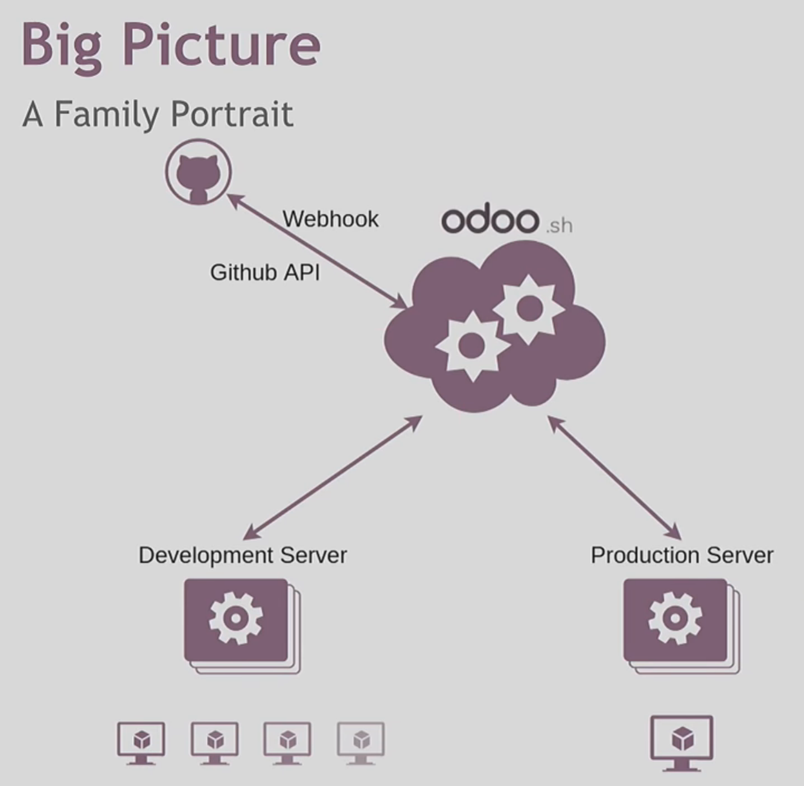

# Odoo Cloud Platform - Odoo.sh

## Architecture

## Setup project

## Stages

Development > Stagging > Production

## Production Stage

- production database
- only one branch
- stable
- live
- no unit test

> When there is a change in production branch, a build created and restart the server with the new code and try to load the current database on it.

> If the modules update fails, the server is automatically reverted to the previous successful code revision and the database is roll-backed as it was before the update.

## Stagging

- test new feature on production database
- more than one branch
- mailcatcher
- can merger to production branch
- no unit test

> Commits on stagging branches will update the pevious build on a duplicate of production database

> Builds for Stagging and Production are in the same server but they access different codes and database, while builds for development are in other servers

## Development Stage

- demo data
- mailcatcher
- many branches
- can merge to a branch in Stagging or move it to Stagging

> When pushing a new commit, a new server is started, with a database created from scratch, demo data is loaded, and the unit tests are performed by default.

## Backups

- daily backups for production database, incremental backups
- each backup includes: database dump, filestore (attachments, binary fields), logs, sessions
- stagging and development databases are not backed up
- can import database from:
  - Odoo on-premise database manager
  - Odoo Online database manager
  - Odoo.sh backup download
  - Odoo.sh dump download

## Tabs

