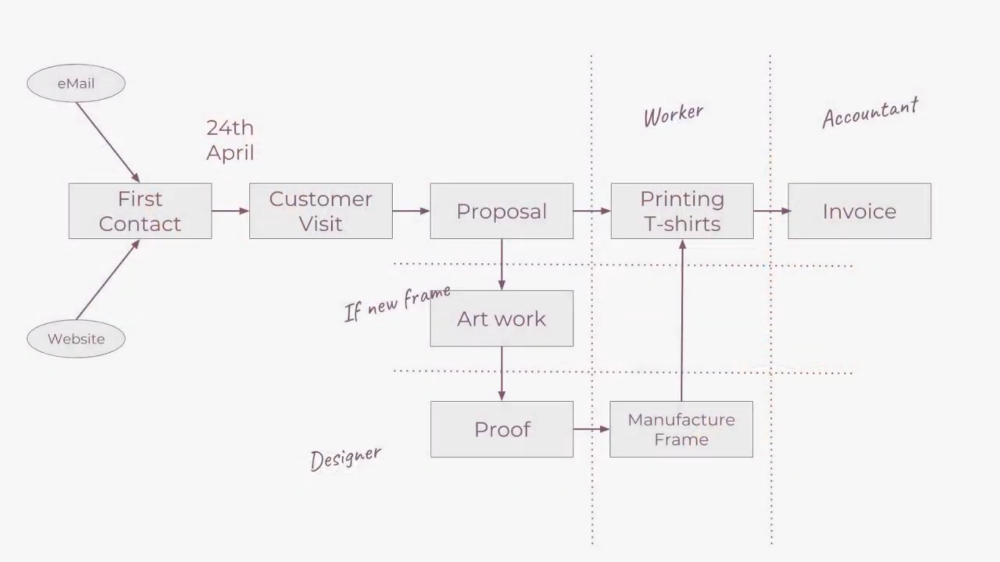

> This is created specifically for the [Odoo Use Case](https://www.odoo.com/slides/slide/branded-t-shirts-case-719?fullscreen=1) Course on Odoo eLearning since this part worths the attention in my point of view

# Branded T-shirt

## Requirements

- Simplify things
- Know which order is at which stage
- Track time to manufacture frames and print T-shirts
- Optimize the process

- Automation of leads creation from website
- Priority on leads
- Scheduling of reminders, actions
- Receive logo from customer in the SO process
- All our products in one place

## Solutions

# Motocycle Company

## Requirements

### Business

- Build & Sell Electric Motocycles
- 50 Employees - 4 Departments: Sales, Inventory, Manufacturing, Administration
- Founded & located in Croatia
- Selling worldwide
- 1000+ bikes produced & sold per year

### Manufacture needs

- Complete manufacturing process
- Multiple plants
- Quality process
- Link customer to their bikes

### Other needs

- Matching & Follow up on payments
- discounts
- Inventory management

# Superstar Logistics

One distribution center and store revolving around it

## Description

Distribution Center/
|
|--Store 1
|--Store 2
|--Store 3
|--Store 4

- Purchasing activities take place in the Central Warehouse (Stores are not allowed to order directly from external suppliers)
- They refill the store shelves directly from central warehouse
- At the launch of the new product range, the purchasing department places a big order to the external suppliers in order to fill in the distribution center with its buffer stock and the stores with the initial amount which was forecasted
- As soon as the order is received at the distribution center, the warehouse department dispatches the goods to the stores following a predetermined repartition
- The long-term supply strategy is then to maintain minimum stock level in the stores for each SKU (Stock Keeping Unit) and act upon the same methodology in the central warehouse

## Summary of needs

- One central warehouse and four remote stores
- Purchase in the central, internal resupply in the stores
- Manual dispatch to the stores at product launch
- Automated resupply on the long run

## Questions

- What would be the preferred set up for this network configuration?
- How would you handle occasional resupply from stores to stores
